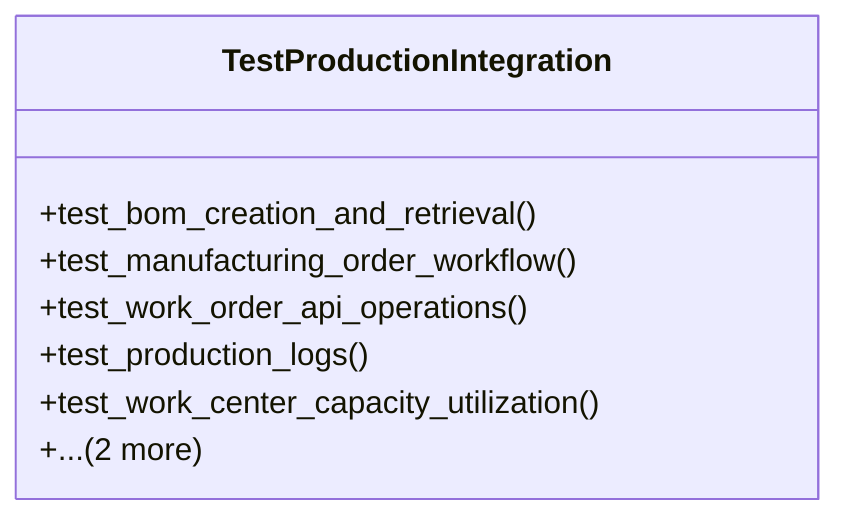

# business_modules.production.tests.test_integration

## Imports
- business_modules.inventory.models
- business_modules.production.models
- business_modules.production.services
- django.contrib.auth.models
- django.urls
- django.utils
- pytest
- rest_framework
- rest_framework.test

## Classes
- TestProductionIntegration
  - method: `test_bom_creation_and_retrieval`
  - method: `test_manufacturing_order_workflow`
  - method: `test_work_order_api_operations`
  - method: `test_production_logs`
  - method: `test_work_center_capacity_utilization`
  - method: `test_bom_duplication`
  - method: `test_routing_duplication`

## Functions
- api_client
- user
- authenticated_client
- product
- component_product
- unit_of_measure
- work_center
- bom
- routing
- manufacturing_order
- test_bom_creation_and_retrieval
- test_manufacturing_order_workflow
- test_work_order_api_operations
- test_production_logs
- test_work_center_capacity_utilization
- test_bom_duplication
- test_routing_duplication

## Class Diagram

