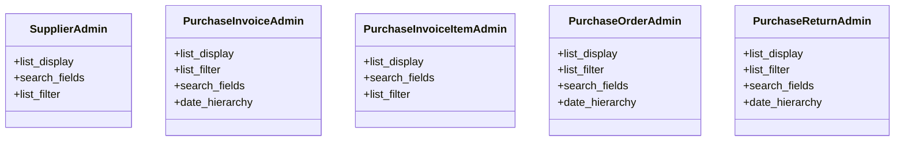

# business_modules.purchasing.admin

## Imports
- django.contrib
- models

## Classes
- SupplierAdmin
  - attr: `list_display`
  - attr: `search_fields`
  - attr: `list_filter`
- PurchaseInvoiceAdmin
  - attr: `list_display`
  - attr: `list_filter`
  - attr: `search_fields`
  - attr: `date_hierarchy`
- PurchaseInvoiceItemAdmin
  - attr: `list_display`
  - attr: `search_fields`
  - attr: `list_filter`
- PurchaseOrderAdmin
  - attr: `list_display`
  - attr: `list_filter`
  - attr: `search_fields`
  - attr: `date_hierarchy`
- PurchaseReturnAdmin
  - attr: `list_display`
  - attr: `list_filter`
  - attr: `search_fields`
  - attr: `date_hierarchy`

## Class Diagram

