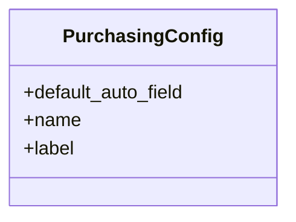

# business_modules.purchasing.apps

## Imports
- django.apps

## Classes
- PurchasingConfig
  - attr: `default_auto_field`
  - attr: `name`
  - attr: `label`

## Class Diagram

```mermaid
classDiagram
    class PurchasingConfig {
        +default_auto_field
        +name
        +label
    }
```
