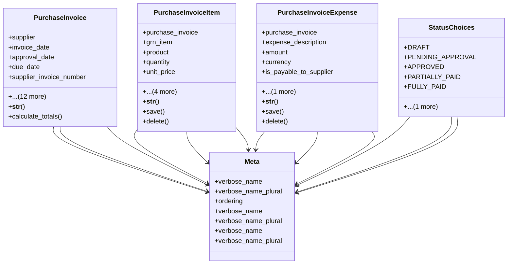

# business_modules.purchasing.invoices

## Imports
- business_modules.inventory.products
- contacts.models
- core_modules.organization.models
- decimal
- django.conf
- django.core.validators
- django.db
- django.utils.translation
- goods_receipt

## Classes
- PurchaseInvoice
  - attr: `supplier`
  - attr: `invoice_date`
  - attr: `approval_date`
  - attr: `due_date`
  - attr: `supplier_invoice_number`
  - attr: `status`
  - attr: `total_amount`
  - attr: `tax_amount`
  - attr: `discount_amount`
  - attr: `additional_costs_total`
  - attr: `currency`
  - attr: `exchange_rate_at_approval`
  - attr: `notes`
  - attr: `created_by`
  - attr: `approved_by`
  - attr: `created_at`
  - attr: `updated_at`
  - method: `__str__`
  - method: `calculate_totals`
- PurchaseInvoiceItem
  - attr: `purchase_invoice`
  - attr: `grn_item`
  - attr: `product`
  - attr: `quantity`
  - attr: `unit_price`
  - attr: `tax_rate`
  - attr: `discount_percentage`
  - attr: `total_price`
  - attr: `notes`
  - method: `__str__`
  - method: `save`
  - method: `delete`
- PurchaseInvoiceExpense
  - attr: `purchase_invoice`
  - attr: `expense_description`
  - attr: `amount`
  - attr: `currency`
  - attr: `is_payable_to_supplier`
  - attr: `distribute_to_item_cost`
  - method: `__str__`
  - method: `save`
  - method: `delete`
- StatusChoices
  - attr: `DRAFT`
  - attr: `PENDING_APPROVAL`
  - attr: `APPROVED`
  - attr: `PARTIALLY_PAID`
  - attr: `FULLY_PAID`
  - attr: `REJECTED`
- Meta
  - attr: `verbose_name`
  - attr: `verbose_name_plural`
  - attr: `ordering`
- Meta
  - attr: `verbose_name`
  - attr: `verbose_name_plural`
- Meta
  - attr: `verbose_name`
  - attr: `verbose_name_plural`

## Functions
- __str__
- calculate_totals
- __str__
- save
- delete
- __str__
- save
- delete

## Class Diagram

