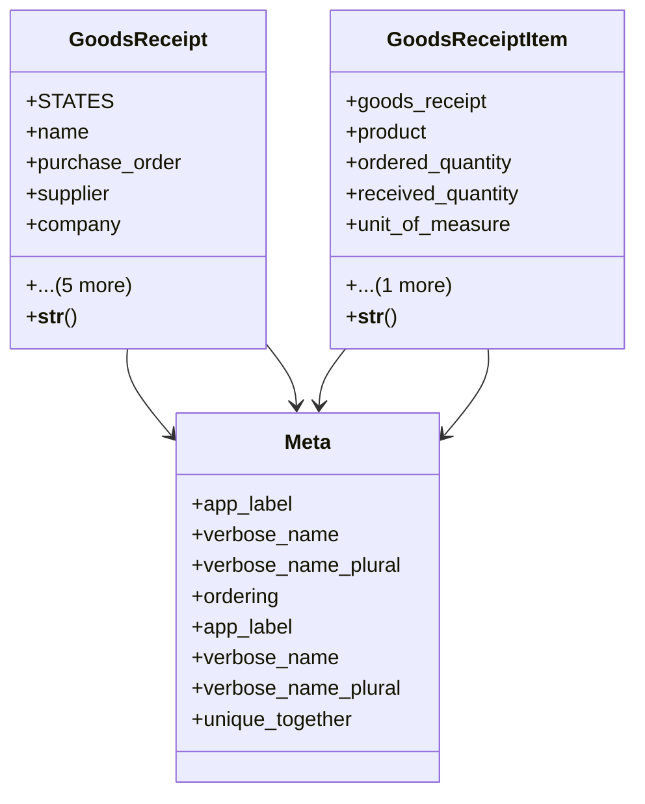

# business_modules.purchasing.models.goods_receipt

## Imports
- business_modules.inventory.models
- core_modules.companies.models
- core_modules.core.models.base_models
- django.core.validators
- django.db
- django.utils
- django.utils.translation
- purchase_order
- supplier

## Classes
- GoodsReceipt
  - attr: `STATES`
  - attr: `name`
  - attr: `purchase_order`
  - attr: `supplier`
  - attr: `company`
  - attr: `branch`
  - attr: `warehouse`
  - attr: `receipt_date`
  - attr: `state`
  - attr: `notes`
  - method: `__str__`
- GoodsReceiptItem
  - attr: `goods_receipt`
  - attr: `product`
  - attr: `ordered_quantity`
  - attr: `received_quantity`
  - attr: `unit_of_measure`
  - attr: `notes`
  - method: `__str__`
- Meta
  - attr: `app_label`
  - attr: `verbose_name`
  - attr: `verbose_name_plural`
  - attr: `ordering`
- Meta
  - attr: `app_label`
  - attr: `verbose_name`
  - attr: `verbose_name_plural`
  - attr: `unique_together`

## Functions
- __str__
- __str__

## Class Diagram

