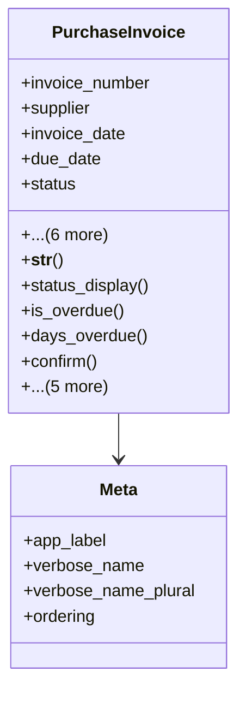

# business_modules.purchasing.models.purchase_invoice

## Imports
- django.conf
- django.db
- django.utils
- purchase_invoice_status
- supplier

## Classes
- PurchaseInvoice
  - attr: `invoice_number`
  - attr: `supplier`
  - attr: `invoice_date`
  - attr: `due_date`
  - attr: `status`
  - attr: `total_amount`
  - attr: `notes`
  - attr: `created_at`
  - attr: `created_by`
  - attr: `parent_invoice`
  - attr: `is_parent_consolidated`
  - method: `__str__`
  - method: `status_display`
  - method: `is_overdue`
  - method: `days_overdue`
  - method: `confirm`
  - method: `mark_as_paid`
  - method: `cancel`
  - method: `recalculate_total`
  - method: `has_child_invoices`
  - method: `consolidate_child_invoices`
- Meta
  - attr: `app_label`
  - attr: `verbose_name`
  - attr: `verbose_name_plural`
  - attr: `ordering`

## Functions
- __str__
- status_display
- is_overdue
- days_overdue
- confirm
- mark_as_paid
- cancel
- recalculate_total
- has_child_invoices
- consolidate_child_invoices

## Class Diagram

