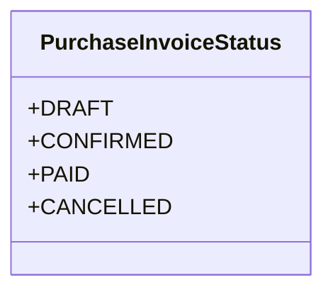

# business_modules.purchasing.models.purchase_invoice_status

## Imports
- django.db

## Classes
- PurchaseInvoiceStatus
  - attr: `DRAFT`
  - attr: `CONFIRMED`
  - attr: `PAID`
  - attr: `CANCELLED`

## Class Diagram

