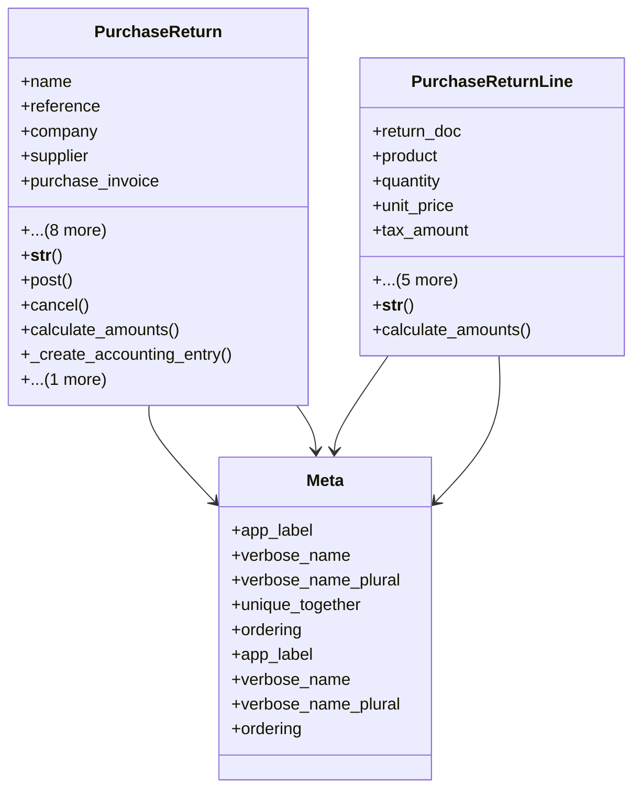

# business_modules.purchasing.models.purchase_return

## Imports
- business_modules.inventory.models
- core_modules.companies.models
- core_modules.core.models.base_models
- django.db
- django.utils
- django.utils.translation
- purchase_invoice
- services_modules.accounting.models
- services_modules.inventory.models
- supplier

## Classes
- PurchaseReturn
  - attr: `name`
  - attr: `reference`
  - attr: `company`
  - attr: `supplier`
  - attr: `purchase_invoice`
  - attr: `date`
  - attr: `warehouse`
  - attr: `untaxed_amount`
  - attr: `tax_amount`
  - attr: `total_amount`
  - attr: `state`
  - attr: `return_reason`
  - attr: `notes`
  - method: `__str__`
  - method: `post`
  - method: `cancel`
  - method: `calculate_amounts`
  - method: `_create_accounting_entry`
  - method: `_update_inventory`
- PurchaseReturnLine
  - attr: `return_doc`
  - attr: `product`
  - attr: `quantity`
  - attr: `unit_price`
  - attr: `tax_amount`
  - attr: `subtotal`
  - attr: `total`
  - attr: `description`
  - attr: `sequence`
  - attr: `return_reason`
  - method: `__str__`
  - method: `calculate_amounts`
- Meta
  - attr: `app_label`
  - attr: `verbose_name`
  - attr: `verbose_name_plural`
  - attr: `unique_together`
  - attr: `ordering`
- Meta
  - attr: `app_label`
  - attr: `verbose_name`
  - attr: `verbose_name_plural`
  - attr: `ordering`

## Functions
- __str__
- post
- cancel
- calculate_amounts
- _create_accounting_entry
- _update_inventory
- __str__
- calculate_amounts

## Class Diagram

