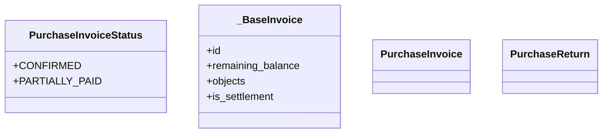

# business_modules.purchasing.models.stub_minimal

## Imports
- __future__

## Classes
- PurchaseInvoiceStatus
  - attr: `CONFIRMED`
  - attr: `PARTIALLY_PAID`
- _BaseInvoice
  - attr: `id`
  - attr: `remaining_balance`
  - attr: `objects`
  - attr: `is_settlement`
- PurchaseInvoice
- PurchaseReturn

## Module Variables
- `__all__`

## Class Diagram

