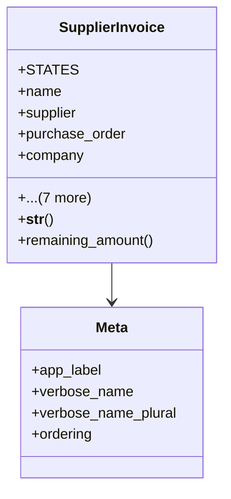

# business_modules.purchasing.models.supplier_invoice

## Imports
- core_modules.companies.models
- core_modules.core.models.base_models
- django.db
- django.utils
- django.utils.translation
- purchase_order
- supplier

## Classes
- SupplierInvoice
  - attr: `STATES`
  - attr: `name`
  - attr: `supplier`
  - attr: `purchase_order`
  - attr: `company`
  - attr: `branch`
  - attr: `invoice_date`
  - attr: `due_date`
  - attr: `state`
  - attr: `total_amount`
  - attr: `paid_amount`
  - attr: `notes`
  - method: `__str__`
  - method: `remaining_amount`
- Meta
  - attr: `app_label`
  - attr: `verbose_name`
  - attr: `verbose_name_plural`
  - attr: `ordering`

## Functions
- __str__
- remaining_amount

## Class Diagram

