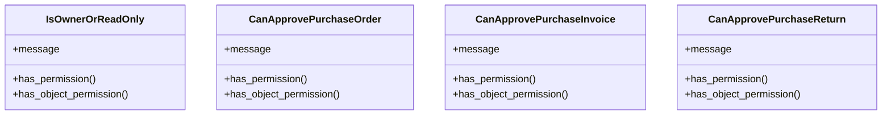

# business_modules.purchasing.permissions

## Imports
- django.utils.translation
- rest_framework

## Classes
- IsOwnerOrReadOnly
  - attr: `message`
  - method: `has_permission`
  - method: `has_object_permission`
- CanApprovePurchaseOrder
  - attr: `message`
  - method: `has_permission`
  - method: `has_object_permission`
- CanApprovePurchaseInvoice
  - attr: `message`
  - method: `has_permission`
  - method: `has_object_permission`
- CanApprovePurchaseReturn
  - attr: `message`
  - method: `has_permission`
  - method: `has_object_permission`

## Functions
- _is_in_groups
- has_permission
- has_object_permission
- has_permission
- has_object_permission
- has_permission
- has_object_permission
- has_permission
- has_object_permission

## Class Diagram

