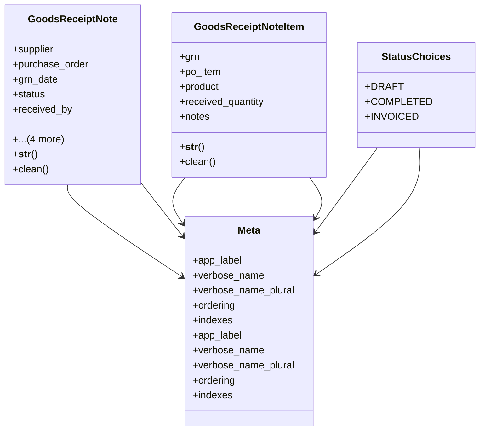

# business_modules.purchasing.receipts

## Imports
- business_modules.inventory.base
- business_modules.inventory.products
- contacts.models
- decimal
- django.conf
- django.core.exceptions
- django.core.validators
- django.db
- django.utils
- django.utils.translation
- orders

## Classes
- GoodsReceiptNote
  - attr: `supplier`
  - attr: `purchase_order`
  - attr: `grn_date`
  - attr: `status`
  - attr: `received_by`
  - attr: `store`
  - attr: `notes`
  - attr: `created_at`
  - attr: `updated_at`
  - method: `__str__`
  - method: `clean`
- GoodsReceiptNoteItem
  - attr: `grn`
  - attr: `po_item`
  - attr: `product`
  - attr: `received_quantity`
  - attr: `notes`
  - method: `__str__`
  - method: `clean`
- StatusChoices
  - attr: `DRAFT`
  - attr: `COMPLETED`
  - attr: `INVOICED`
- Meta
  - attr: `app_label`
  - attr: `verbose_name`
  - attr: `verbose_name_plural`
  - attr: `ordering`
  - attr: `indexes`
- Meta
  - attr: `app_label`
  - attr: `verbose_name`
  - attr: `verbose_name_plural`
  - attr: `ordering`
  - attr: `indexes`

## Functions
- __str__
- clean
- __str__
- clean

## Class Diagram

