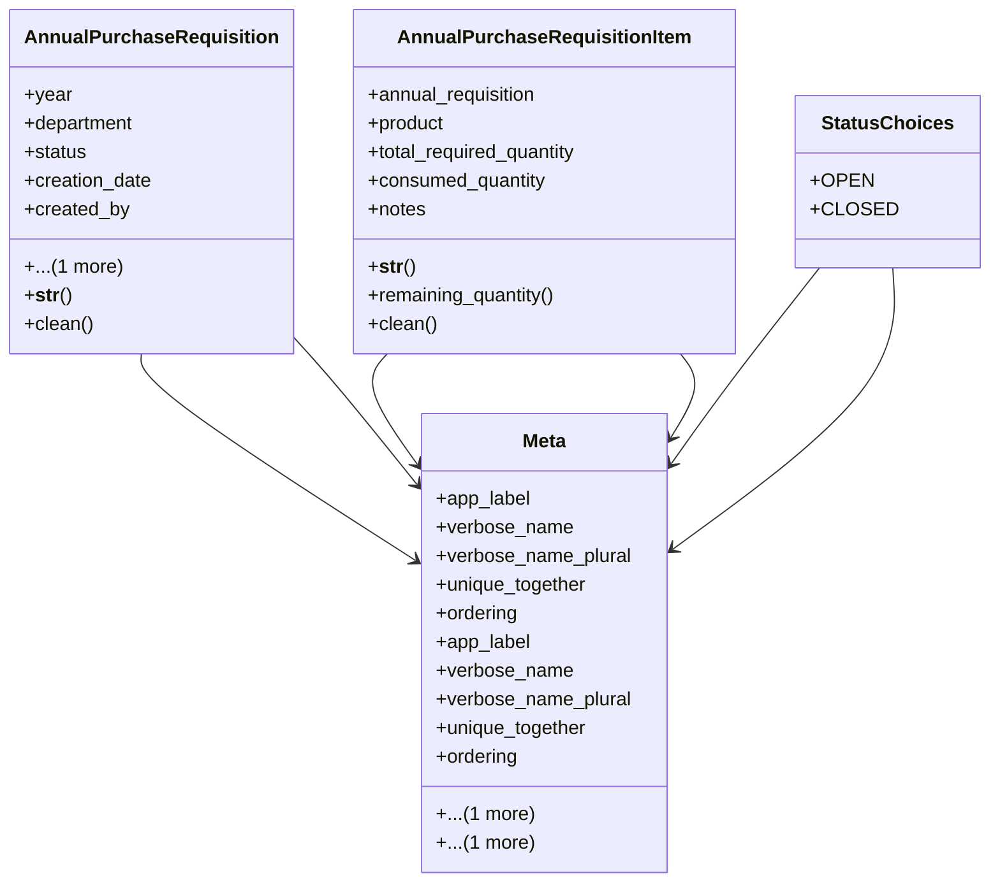

# business_modules.purchasing.requisitions

## Imports
- business_modules.inventory.products
- decimal
- django.conf
- django.core.exceptions
- django.core.validators
- django.db
- django.utils
- django.utils.translation
- hr.models

## Classes
- AnnualPurchaseRequisition
  - attr: `year`
  - attr: `department`
  - attr: `status`
  - attr: `creation_date`
  - attr: `created_by`
  - attr: `notes`
  - method: `__str__`
  - method: `clean`
- AnnualPurchaseRequisitionItem
  - attr: `annual_requisition`
  - attr: `product`
  - attr: `total_required_quantity`
  - attr: `consumed_quantity`
  - attr: `notes`
  - method: `__str__`
  - method: `remaining_quantity`
  - method: `clean`
- StatusChoices
  - attr: `OPEN`
  - attr: `CLOSED`
- Meta
  - attr: `app_label`
  - attr: `verbose_name`
  - attr: `verbose_name_plural`
  - attr: `unique_together`
  - attr: `ordering`
  - attr: `indexes`
- Meta
  - attr: `app_label`
  - attr: `verbose_name`
  - attr: `verbose_name_plural`
  - attr: `unique_together`
  - attr: `ordering`
  - attr: `indexes`

## Functions
- __str__
- clean
- __str__
- remaining_quantity
- clean

## Class Diagram

