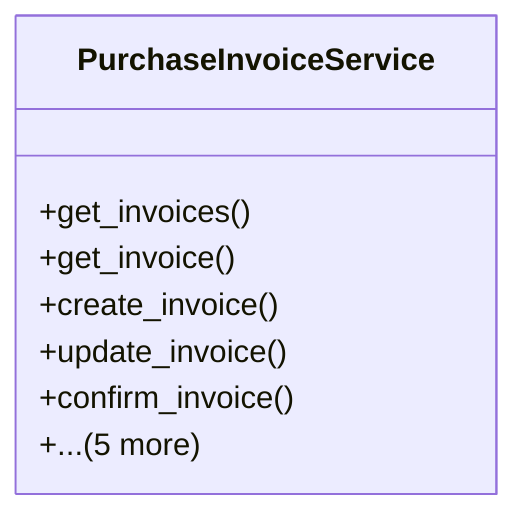

# business_modules.purchasing.services

## Imports
- business_modules.accounting.models.settlement
- business_modules.contacts.models
- django.db
- django.db.models
- django.utils
- models

## Classes
- PurchaseInvoiceService
  - method: `get_invoices`
  - method: `get_invoice`
  - method: `create_invoice`
  - method: `update_invoice`
  - method: `confirm_invoice`
  - method: `cancel_invoice`
  - method: `add_payment`
  - method: `get_supplier_invoices_summary`
  - method: `get_supplier_settlement_eligible_invoices`
  - method: `process_settlement_payment`

## Functions
- get_invoices
- get_invoice
- create_invoice
- update_invoice
- confirm_invoice
- cancel_invoice
- add_payment
- get_supplier_invoices_summary
- get_supplier_settlement_eligible_invoices
- process_settlement_payment

## Class Diagram

