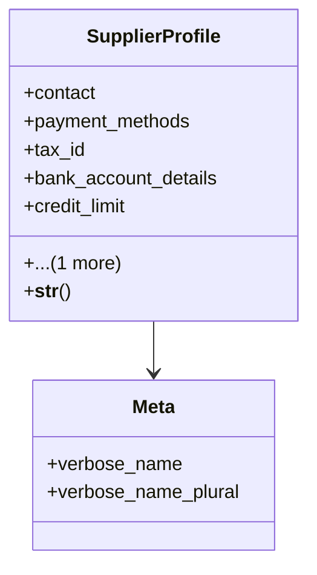

# business_modules.purchasing.suppliers

## Imports
- contacts.models
- core_modules.organization.models
- decimal
- django.core.validators
- django.db
- django.utils.translation

## Classes
- SupplierProfile
  - attr: `contact`
  - attr: `payment_methods`
  - attr: `tax_id`
  - attr: `bank_account_details`
  - attr: `credit_limit`
  - attr: `default_currency`
  - method: `__str__`
- Meta
  - attr: `verbose_name`
  - attr: `verbose_name_plural`

## Functions
- __str__

## Class Diagram

