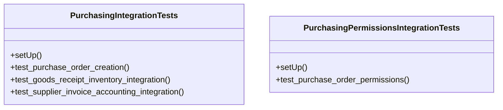

# business_modules.purchasing.tests.test_integration

## Imports
- core_modules.accounting.models
- core_modules.companies.models
- core_modules.inventory.models
- core_modules.purchasing.models
- django.contrib.auth.models
- django.contrib.contenttypes.models
- django.test
- django.urls
- rest_framework
- rest_framework.test

## Classes
- PurchasingIntegrationTests
  - method: `setUp`
  - method: `test_purchase_order_creation`
  - method: `test_goods_receipt_inventory_integration`
  - method: `test_supplier_invoice_accounting_integration`
- PurchasingPermissionsIntegrationTests
  - method: `setUp`
  - method: `test_purchase_order_permissions`

## Functions
- setUp
- test_purchase_order_creation
- test_goods_receipt_inventory_integration
- test_supplier_invoice_accounting_integration
- setUp
- test_purchase_order_permissions

## Class Diagram

