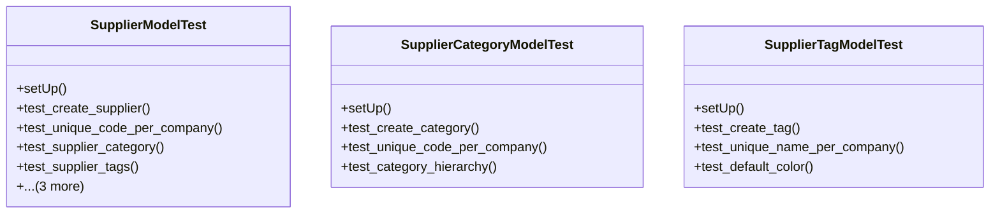

# business_modules.purchasing.tests.test_supplier

## Imports
- decimal
- django.core.exceptions
- django.db
- django.test
- models.supplier
- services_modules.accounting.models
- services_modules.core.models

## Classes
- SupplierModelTest
  - method: `setUp`
  - method: `test_create_supplier`
  - method: `test_unique_code_per_company`
  - method: `test_supplier_category`
  - method: `test_supplier_tags`
  - method: `test_get_balance`
  - method: `test_get_credit_available`
  - method: `test_is_credit_limit_exceeded`
- SupplierCategoryModelTest
  - method: `setUp`
  - method: `test_create_category`
  - method: `test_unique_code_per_company`
  - method: `test_category_hierarchy`
- SupplierTagModelTest
  - method: `setUp`
  - method: `test_create_tag`
  - method: `test_unique_name_per_company`
  - method: `test_default_color`

## Functions
- setUp
- test_create_supplier
- test_unique_code_per_company
- test_supplier_category
- test_supplier_tags
- test_get_balance
- test_get_credit_available
- test_is_credit_limit_exceeded
- setUp
- test_create_category
- test_unique_code_per_company
- test_category_hierarchy
- setUp
- test_create_tag
- test_unique_name_per_company
- test_default_color
- mock_get_balance

## Class Diagram

