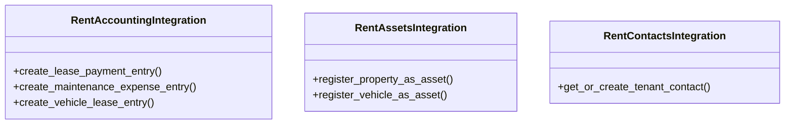

# business_modules.rent.integration

## Imports
- business_modules.accounting.services.journal_service
- business_modules.assets.models
- business_modules.assets.services
- business_modules.contacts.models
- business_modules.rent.models
- django.db.models.signals
- django.dispatch
- django.utils

## Classes
- RentAccountingIntegration
  - method: `create_lease_payment_entry`
  - method: `create_maintenance_expense_entry`
  - method: `create_vehicle_lease_entry`
- RentAssetsIntegration
  - method: `register_property_as_asset`
  - method: `register_vehicle_as_asset`
- RentContactsIntegration
  - method: `get_or_create_tenant_contact`

## Functions
- handle_lease_payment_save
- handle_maintenance_request_save
- handle_vehicle_lease_save
- create_lease_payment_entry
- create_maintenance_expense_entry
- create_vehicle_lease_entry
- register_property_as_asset
- register_vehicle_as_asset
- get_or_create_tenant_contact

## Class Diagram

