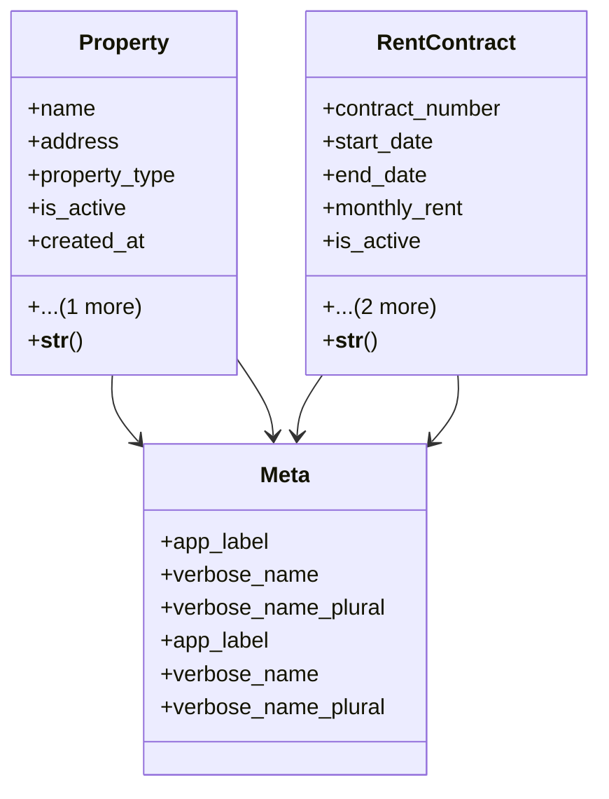

# business_modules.rent.models

## Imports
- django.db
- django.utils.translation

## Classes
- Property
  - attr: `name`
  - attr: `address`
  - attr: `property_type`
  - attr: `is_active`
  - attr: `created_at`
  - attr: `updated_at`
  - method: `__str__`
- RentContract
  - attr: `contract_number`
  - attr: `start_date`
  - attr: `end_date`
  - attr: `monthly_rent`
  - attr: `is_active`
  - attr: `created_at`
  - attr: `updated_at`
  - method: `__str__`
- Meta
  - attr: `app_label`
  - attr: `verbose_name`
  - attr: `verbose_name_plural`
- Meta
  - attr: `app_label`
  - attr: `verbose_name`
  - attr: `verbose_name_plural`

## Functions
- __str__
- __str__

## Class Diagram

