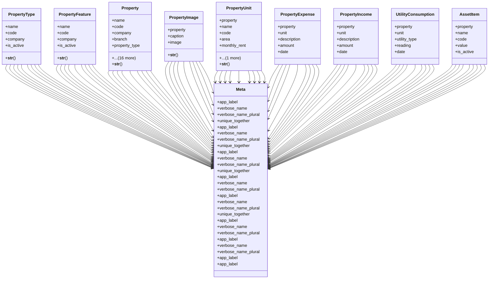

# business_modules.rent.models.property

## Imports
- decimal
- django.db
- django.utils.translation
- services_modules.core.models

## Classes
- PropertyType
  - attr: `name`
  - attr: `code`
  - attr: `company`
  - attr: `is_active`
  - method: `__str__`
- PropertyFeature
  - attr: `name`
  - attr: `code`
  - attr: `company`
  - attr: `is_active`
  - method: `__str__`
- Property
  - attr: `name`
  - attr: `code`
  - attr: `company`
  - attr: `branch`
  - attr: `property_type`
  - attr: `address`
  - attr: `area`
  - attr: `bedrooms`
  - attr: `bathrooms`
  - attr: `purchase_value`
  - attr: `market_value`
  - attr: `monthly_rent`
  - attr: `description`
  - attr: `status`
  - attr: `is_active`
  - attr: `asset_account`
  - attr: `income_account`
  - attr: `expense_account`
  - attr: `created_at`
  - attr: `updated_at`
  - attr: `features`
  - method: `__str__`
- PropertyImage
  - attr: `property`
  - attr: `caption`
  - attr: `image`
  - method: `__str__`
- PropertyUnit
  - attr: `property`
  - attr: `name`
  - attr: `code`
  - attr: `area`
  - attr: `monthly_rent`
  - attr: `is_active`
  - method: `__str__`
- PropertyExpense
  - attr: `property`
  - attr: `unit`
  - attr: `description`
  - attr: `amount`
  - attr: `date`
- PropertyIncome
  - attr: `property`
  - attr: `unit`
  - attr: `description`
  - attr: `amount`
  - attr: `date`
- UtilityConsumption
  - attr: `property`
  - attr: `unit`
  - attr: `utility_type`
  - attr: `reading`
  - attr: `date`
- AssetItem
  - attr: `property`
  - attr: `name`
  - attr: `code`
  - attr: `value`
  - attr: `is_active`
- Meta
  - attr: `app_label`
  - attr: `verbose_name`
  - attr: `verbose_name_plural`
  - attr: `unique_together`
- Meta
  - attr: `app_label`
  - attr: `verbose_name`
  - attr: `verbose_name_plural`
  - attr: `unique_together`
- Meta
  - attr: `app_label`
  - attr: `verbose_name`
  - attr: `verbose_name_plural`
  - attr: `unique_together`
- Meta
  - attr: `app_label`
  - attr: `verbose_name`
  - attr: `verbose_name_plural`
- Meta
  - attr: `app_label`
  - attr: `verbose_name`
  - attr: `verbose_name_plural`
  - attr: `unique_together`
- Meta
  - attr: `app_label`
  - attr: `verbose_name`
  - attr: `verbose_name_plural`
- Meta
  - attr: `app_label`
  - attr: `verbose_name`
  - attr: `verbose_name_plural`
- Meta
  - attr: `app_label`
- Meta
  - attr: `app_label`

## Functions
- __str__
- __str__
- __str__
- __str__
- __str__

## Module Variables
- `PROPERTY_UNIT_FK`
- `ACCOUNT_MODEL_REF`

## Class Diagram

