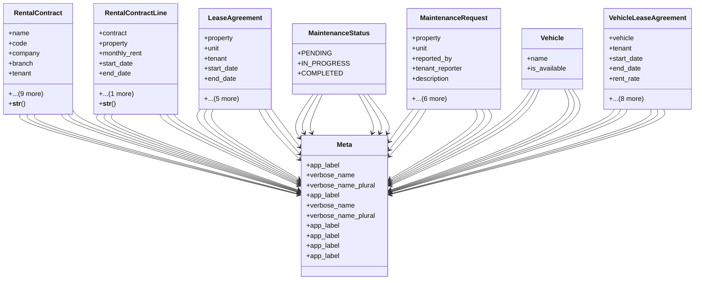

# business_modules.rent.models.rental_contract

## Imports
- decimal
- django.db
- django.utils.translation
- property

## Classes
- RentalContract
  - attr: `name`
  - attr: `code`
  - attr: `company`
  - attr: `branch`
  - attr: `tenant`
  - attr: `journal`
  - attr: `start_date`
  - attr: `end_date`
  - attr: `payment_frequency`
  - attr: `security_deposit`
  - attr: `notes`
  - attr: `is_active`
  - attr: `created_at`
  - attr: `updated_at`
  - method: `__str__`
- RentalContractLine
  - attr: `contract`
  - attr: `property`
  - attr: `monthly_rent`
  - attr: `start_date`
  - attr: `end_date`
  - attr: `is_active`
  - method: `__str__`
- LeaseAgreement
  - attr: `property`
  - attr: `unit`
  - attr: `tenant`
  - attr: `start_date`
  - attr: `end_date`
  - attr: `rent_amount`
  - attr: `payment_frequency`
  - attr: `deposit_amount`
  - attr: `terms`
  - attr: `is_active`
- MaintenanceStatus
  - attr: `PENDING`
  - attr: `IN_PROGRESS`
  - attr: `COMPLETED`
- MaintenanceRequest
  - attr: `property`
  - attr: `unit`
  - attr: `reported_by`
  - attr: `tenant_reporter`
  - attr: `description`
  - attr: `status`
  - attr: `reported_date`
  - attr: `completed_date`
  - attr: `cost`
  - attr: `is_unit_specific_cost`
  - attr: `journal_entry`
- Vehicle
  - attr: `name`
  - attr: `is_available`
- VehicleLeaseAgreement
  - attr: `vehicle`
  - attr: `tenant`
  - attr: `start_date`
  - attr: `end_date`
  - attr: `rent_rate`
  - attr: `rate_unit`
  - attr: `pickup_odometer`
  - attr: `pickup_fuel_level`
  - attr: `return_odometer`
  - attr: `return_fuel_level`
  - attr: `deposit_amount`
  - attr: `total_charge`
  - attr: `is_active`
- Meta
  - attr: `app_label`
  - attr: `verbose_name`
  - attr: `verbose_name_plural`
- Meta
  - attr: `app_label`
  - attr: `verbose_name`
  - attr: `verbose_name_plural`
- Meta
  - attr: `app_label`
- Meta
  - attr: `app_label`
- Meta
  - attr: `app_label`
- Meta
  - attr: `app_label`

## Functions
- __str__
- __str__

## Class Diagram

