# business_modules.rent.serializers

## Imports
- models
- rest_framework

## Classes
- PropertySerializer
  - attr: `units_count`
  - attr: `active_contracts_count`
  - method: `get_units_count`
  - method: `get_active_contracts_count`
- PropertyUnitSerializer
  - attr: `property_name`
  - attr: `is_rented`
  - method: `get_is_rented`
- PropertyExpenseSerializer
  - attr: `property_name`
  - attr: `unit_number`
- UtilityConsumptionSerializer
  - attr: `property_name`
  - attr: `unit_number`
- RentalContractSerializer
  - attr: `property_name`
  - attr: `unit_number`
  - attr: `is_active`
  - attr: `days_until_expiry`
  - attr: `total_payments`
  - attr: `outstanding_amount`
  - method: `get_is_active`
  - method: `get_days_until_expiry`
  - method: `get_total_payments`
  - method: `get_outstanding_amount`
- RentalPaymentSerializer
  - attr: `contract_number`
  - attr: `tenant_name`
  - attr: `is_overdue`
  - method: `get_is_overdue`
- MaintenanceRequestSerializer
  - attr: `property_name`
  - attr: `unit_number`
  - attr: `contract_number`
- VehicleSerializer
  - attr: `company_name`
  - attr: `is_available`
  - attr: `active_contracts_count`
  - method: `get_is_available`
  - method: `get_active_contracts_count`
- VehicleRentalContractSerializer
  - attr: `vehicle_info`
- VehicleMaintenanceLogSerializer
  - attr: `vehicle_info`
- PropertyDetailSerializer
  - attr: `units`
  - attr: `recent_expenses`
  - attr: `active_contracts`
- RentalContractDetailSerializer
  - attr: `payments`
  - attr: `maintenance_requests`
- Meta
  - attr: `model`
  - attr: `fields`
- Meta
  - attr: `model`
  - attr: `fields`
- Meta
  - attr: `model`
  - attr: `fields`
- Meta
  - attr: `model`
  - attr: `fields`
- Meta
  - attr: `model`
  - attr: `fields`
- Meta
  - attr: `model`
  - attr: `fields`
- Meta
  - attr: `model`
  - attr: `fields`
- Meta
  - attr: `model`
  - attr: `fields`
- Meta
  - attr: `model`
  - attr: `fields`
- Meta
  - attr: `model`
  - attr: `fields`
- Meta
- Meta

## Functions
- get_units_count
- get_active_contracts_count
- get_is_rented
- get_is_active
- get_days_until_expiry
- get_total_payments
- get_outstanding_amount
- get_is_overdue
- get_is_available
- get_active_contracts_count

## Class Diagram

```mermaid
classDiagram
    class PropertySerializer {
        +units_count
        +active_contracts_count
        +get_units_count()
        +get_active_contracts_count()
    }
    class PropertyUnitSerializer {
        +property_name
        +is_rented
        +get_is_rented()
    }
    class PropertyExpenseSerializer {
        +property_name
        +unit_number
    }
    class UtilityConsumptionSerializer {
        +property_name
        +unit_number
    }
    class RentalContractSerializer {
        +property_name
        +unit_number
        +is_active
        +days_until_expiry
        +total_payments
        +... (1 more)
        +get_is_active()
        +get_days_until_expiry()
        +get_total_payments()
        +get_outstanding_amount()
    }
    class RentalPaymentSerializer {
        +contract_number
        +tenant_name
        +is_overdue
        +get_is_overdue()
    }
    class MaintenanceRequestSerializer {
        +property_name
        +unit_number
        +contract_number
    }
    class VehicleSerializer {
        +company_name
        +is_available
        +active_contracts_count
        +get_is_available()
        +get_active_contracts_count()
    }
    class VehicleRentalContractSerializer {
        +vehicle_info
    }
    class VehicleMaintenanceLogSerializer {
        +vehicle_info
    }
    class PropertyDetailSerializer {
        +units
        +recent_expenses
        +active_contracts
    }
    class RentalContractDetailSerializer {
        +payments
        +maintenance_requests
    }
    class Meta {
        +model
        +fields
    }
    class Meta {
        +model
        +fields
    }
    class Meta {
        +model
        +fields
    }
    class Meta {
        +model
        +fields
    }
    class Meta {
        +model
        +fields
    }
    class Meta {
        +model
        +fields
    }
    class Meta {
        +model
        +fields
    }
    class Meta {
        +model
        +fields
    }
    class Meta {
        +model
        +fields
    }
    class Meta {
        +model
        +fields
    }
    class Meta {
    }
    class Meta {
    }
    PropertySerializer --> Meta
    PropertySerializer --> Meta
    PropertySerializer --> Meta
    PropertySerializer --> Meta
    PropertySerializer --> Meta
    PropertySerializer --> Meta
    PropertySerializer --> Meta
    PropertySerializer --> Meta
    PropertySerializer --> Meta
    PropertySerializer --> Meta
    PropertySerializer --> Meta
    PropertySerializer --> Meta
    PropertyUnitSerializer --> Meta
    PropertyUnitSerializer --> Meta
    PropertyUnitSerializer --> Meta
    PropertyUnitSerializer --> Meta
    PropertyUnitSerializer --> Meta
    PropertyUnitSerializer --> Meta
    PropertyUnitSerializer --> Meta
    PropertyUnitSerializer --> Meta
    PropertyUnitSerializer --> Meta
    PropertyUnitSerializer --> Meta
    PropertyUnitSerializer --> Meta
    PropertyUnitSerializer --> Meta
    PropertyExpenseSerializer --> Meta
    PropertyExpenseSerializer --> Meta
    PropertyExpenseSerializer --> Meta
    PropertyExpenseSerializer --> Meta
    PropertyExpenseSerializer --> Meta
    PropertyExpenseSerializer --> Meta
    PropertyExpenseSerializer --> Meta
    PropertyExpenseSerializer --> Meta
    PropertyExpenseSerializer --> Meta
    PropertyExpenseSerializer --> Meta
    PropertyExpenseSerializer --> Meta
    PropertyExpenseSerializer --> Meta
    UtilityConsumptionSerializer --> Meta
    UtilityConsumptionSerializer --> Meta
    UtilityConsumptionSerializer --> Meta
    UtilityConsumptionSerializer --> Meta
    UtilityConsumptionSerializer --> Meta
    UtilityConsumptionSerializer --> Meta
    UtilityConsumptionSerializer --> Meta
    UtilityConsumptionSerializer --> Meta
    UtilityConsumptionSerializer --> Meta
    UtilityConsumptionSerializer --> Meta
    UtilityConsumptionSerializer --> Meta
    UtilityConsumptionSerializer --> Meta
    RentalContractSerializer --> Meta
    RentalContractSerializer --> Meta
    RentalContractSerializer --> Meta
    RentalContractSerializer --> Meta
    RentalContractSerializer --> Meta
    RentalContractSerializer --> Meta
    RentalContractSerializer --> Meta
    RentalContractSerializer --> Meta
    RentalContractSerializer --> Meta
    RentalContractSerializer --> Meta
    RentalContractSerializer --> Meta
    RentalContractSerializer --> Meta
    RentalPaymentSerializer --> Meta
    RentalPaymentSerializer --> Meta
    RentalPaymentSerializer --> Meta
    RentalPaymentSerializer --> Meta
    RentalPaymentSerializer --> Meta
    RentalPaymentSerializer --> Meta
    RentalPaymentSerializer --> Meta
    RentalPaymentSerializer --> Meta
    RentalPaymentSerializer --> Meta
    RentalPaymentSerializer --> Meta
    RentalPaymentSerializer --> Meta
    RentalPaymentSerializer --> Meta
    MaintenanceRequestSerializer --> Meta
    MaintenanceRequestSerializer --> Meta
    MaintenanceRequestSerializer --> Meta
    MaintenanceRequestSerializer --> Meta
    MaintenanceRequestSerializer --> Meta
    MaintenanceRequestSerializer --> Meta
    MaintenanceRequestSerializer --> Meta
    MaintenanceRequestSerializer --> Meta
    MaintenanceRequestSerializer --> Meta
    MaintenanceRequestSerializer --> Meta
    MaintenanceRequestSerializer --> Meta
    MaintenanceRequestSerializer --> Meta
    VehicleSerializer --> Meta
    VehicleSerializer --> Meta
    VehicleSerializer --> Meta
    VehicleSerializer --> Meta
    VehicleSerializer --> Meta
    VehicleSerializer --> Meta
    VehicleSerializer --> Meta
    VehicleSerializer --> Meta
    VehicleSerializer --> Meta
    VehicleSerializer --> Meta
    VehicleSerializer --> Meta
    VehicleSerializer --> Meta
    VehicleRentalContractSerializer --> Meta
    VehicleRentalContractSerializer --> Meta
    VehicleRentalContractSerializer --> Meta
    VehicleRentalContractSerializer --> Meta
    VehicleRentalContractSerializer --> Meta
    VehicleRentalContractSerializer --> Meta
    VehicleRentalContractSerializer --> Meta
    VehicleRentalContractSerializer --> Meta
    VehicleRentalContractSerializer --> Meta
    VehicleRentalContractSerializer --> Meta
    VehicleRentalContractSerializer --> Meta
    VehicleRentalContractSerializer --> Meta
    VehicleMaintenanceLogSerializer --> Meta
    VehicleMaintenanceLogSerializer --> Meta
    VehicleMaintenanceLogSerializer --> Meta
    VehicleMaintenanceLogSerializer --> Meta
    VehicleMaintenanceLogSerializer --> Meta
    VehicleMaintenanceLogSerializer --> Meta
    VehicleMaintenanceLogSerializer --> Meta
    VehicleMaintenanceLogSerializer --> Meta
    VehicleMaintenanceLogSerializer --> Meta
    VehicleMaintenanceLogSerializer --> Meta
    VehicleMaintenanceLogSerializer --> Meta
    VehicleMaintenanceLogSerializer --> Meta
    PropertyDetailSerializer --> Meta
    PropertyDetailSerializer --> Meta
    PropertyDetailSerializer --> Meta
    PropertyDetailSerializer --> Meta
    PropertyDetailSerializer --> Meta
    PropertyDetailSerializer --> Meta
    PropertyDetailSerializer --> Meta
    PropertyDetailSerializer --> Meta
    PropertyDetailSerializer --> Meta
    PropertyDetailSerializer --> Meta
    PropertyDetailSerializer --> Meta
    PropertyDetailSerializer --> Meta
    RentalContractDetailSerializer --> Meta
    RentalContractDetailSerializer --> Meta
    RentalContractDetailSerializer --> Meta
    RentalContractDetailSerializer --> Meta
    RentalContractDetailSerializer --> Meta
    RentalContractDetailSerializer --> Meta
    RentalContractDetailSerializer --> Meta
    RentalContractDetailSerializer --> Meta
    RentalContractDetailSerializer --> Meta
    RentalContractDetailSerializer --> Meta
    RentalContractDetailSerializer --> Meta
    RentalContractDetailSerializer --> Meta
```

