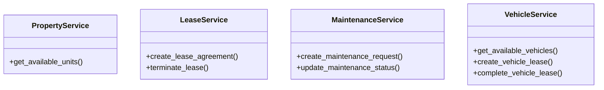

# business_modules.rent.services

## Imports
- decimal
- django.db
- django.db.models
- django.utils
- models

## Classes
- PropertyService
  - method: `get_available_units`
- LeaseService
  - method: `create_lease_agreement`
  - method: `terminate_lease`
- MaintenanceService
  - method: `create_maintenance_request`
  - method: `update_maintenance_status`
- VehicleService
  - method: `get_available_vehicles`
  - method: `create_vehicle_lease`
  - method: `complete_vehicle_lease`

## Functions
- create_journal_entry
- get_available_units
- create_lease_agreement
- terminate_lease
- create_maintenance_request
- update_maintenance_status
- get_available_vehicles
- create_vehicle_lease
- complete_vehicle_lease

## Class Diagram

