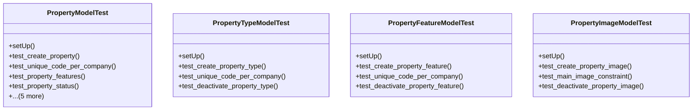

# business_modules.rent.tests.test_property

## Imports
- datetime
- decimal
- django.core.exceptions
- django.db
- django.test
- django.utils
- models.property
- services_modules.accounting.models
- services_modules.core.models

## Classes
- PropertyModelTest
  - method: `setUp`
  - method: `test_create_property`
  - method: `test_unique_code_per_company`
  - method: `test_property_features`
  - method: `test_property_status`
  - method: `test_deactivate_property`
  - method: `test_property_images`
  - method: `test_get_annual_rent`
  - method: `test_get_roi`
  - method: `test_get_current_contract`
- PropertyTypeModelTest
  - method: `setUp`
  - method: `test_create_property_type`
  - method: `test_unique_code_per_company`
  - method: `test_deactivate_property_type`
- PropertyFeatureModelTest
  - method: `setUp`
  - method: `test_create_property_feature`
  - method: `test_unique_code_per_company`
  - method: `test_deactivate_property_feature`
- PropertyImageModelTest
  - method: `setUp`
  - method: `test_create_property_image`
  - method: `test_main_image_constraint`
  - method: `test_deactivate_property_image`

## Functions
- setUp
- test_create_property
- test_unique_code_per_company
- test_property_features
- test_property_status
- test_deactivate_property
- test_property_images
- test_get_annual_rent
- test_get_roi
- test_get_current_contract
- setUp
- test_create_property_type
- test_unique_code_per_company
- test_deactivate_property_type
- setUp
- test_create_property_feature
- test_unique_code_per_company
- test_deactivate_property_feature
- setUp
- test_create_property_image
- test_main_image_constraint
- test_deactivate_property_image
- mock_get_roi
- mock_get_current_contract

## Class Diagram

