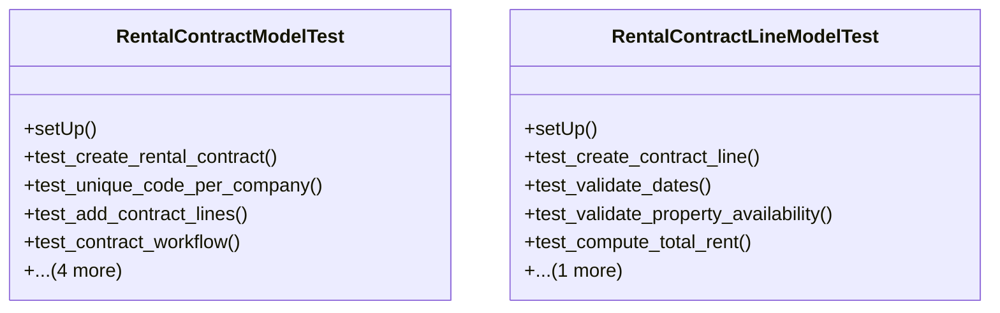

# business_modules.rent.tests.test_rental_contract

## Imports
- datetime
- decimal
- django.core.exceptions
- django.db
- django.test
- django.utils
- models.property
- models.rental_contract
- services_modules.accounting.models
- services_modules.core.models

## Classes
- RentalContractModelTest
  - method: `setUp`
  - method: `test_create_rental_contract`
  - method: `test_unique_code_per_company`
  - method: `test_add_contract_lines`
  - method: `test_contract_workflow`
  - method: `test_validate_dates`
  - method: `test_compute_total_rent`
  - method: `test_get_payment_schedule`
  - method: `test_get_remaining_amount`
- RentalContractLineModelTest
  - method: `setUp`
  - method: `test_create_contract_line`
  - method: `test_validate_dates`
  - method: `test_validate_property_availability`
  - method: `test_compute_total_rent`
  - method: `test_get_rental_period`

## Functions
- setUp
- test_create_rental_contract
- test_unique_code_per_company
- test_add_contract_lines
- test_contract_workflow
- test_validate_dates
- test_compute_total_rent
- test_get_payment_schedule
- test_get_remaining_amount
- setUp
- test_create_contract_line
- test_validate_dates
- test_validate_property_availability
- test_compute_total_rent
- test_get_rental_period
- mock_get_payment_schedule
- mock_get_remaining_amount
- mock_compute_total_rent
- mock_get_rental_period

## Class Diagram

