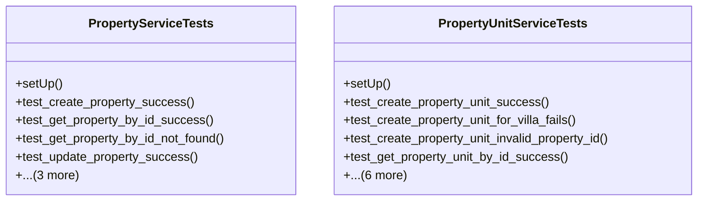

# business_modules.rent.tests.test_services

## Imports
- decimal
- django.http
- django.test
- models
- pytest

## Classes
- PropertyServiceTests
  - method: `setUp`
  - method: `test_create_property_success`
  - method: `test_get_property_by_id_success`
  - method: `test_get_property_by_id_not_found`
  - method: `test_update_property_success`
  - method: `test_update_property_not_found`
  - method: `test_delete_property_success`
  - method: `test_delete_property_not_found`
- PropertyUnitServiceTests
  - method: `setUp`
  - method: `test_create_property_unit_success`
  - method: `test_create_property_unit_for_villa_fails`
  - method: `test_create_property_unit_invalid_property_id`
  - method: `test_get_property_unit_by_id_success`
  - method: `test_get_property_unit_by_id_not_found`
  - method: `test_update_property_unit_success`
  - method: `test_update_property_unit_change_property_fails`
  - method: `test_update_property_unit_not_found`
  - method: `test_delete_property_unit_success`
  - method: `test_delete_property_unit_not_found`

## Functions
- setUp
- test_create_property_success
- test_get_property_by_id_success
- test_get_property_by_id_not_found
- test_update_property_success
- test_update_property_not_found
- test_delete_property_success
- test_delete_property_not_found
- setUp
- test_create_property_unit_success
- test_create_property_unit_for_villa_fails
- test_create_property_unit_invalid_property_id
- test_get_property_unit_by_id_success
- test_get_property_unit_by_id_not_found
- test_update_property_unit_success
- test_update_property_unit_change_property_fails
- test_update_property_unit_not_found
- test_delete_property_unit_success
- test_delete_property_unit_not_found

## Class Diagram

