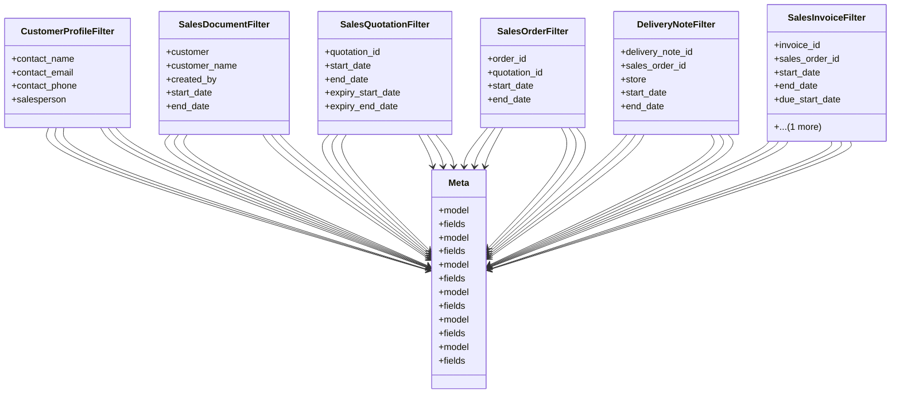

# business_modules.sales.filters

## Imports
- django.utils.translation
- django_filters
- models

## Classes
- CustomerProfileFilter
  - attr: `contact_name`
  - attr: `contact_email`
  - attr: `contact_phone`
  - attr: `salesperson`
- SalesDocumentFilter
  - attr: `customer`
  - attr: `customer_name`
  - attr: `created_by`
  - attr: `start_date`
  - attr: `end_date`
- SalesQuotationFilter
  - attr: `quotation_id`
  - attr: `start_date`
  - attr: `end_date`
  - attr: `expiry_start_date`
  - attr: `expiry_end_date`
- SalesOrderFilter
  - attr: `order_id`
  - attr: `quotation_id`
  - attr: `start_date`
  - attr: `end_date`
- DeliveryNoteFilter
  - attr: `delivery_note_id`
  - attr: `sales_order_id`
  - attr: `store`
  - attr: `start_date`
  - attr: `end_date`
- SalesInvoiceFilter
  - attr: `invoice_id`
  - attr: `sales_order_id`
  - attr: `start_date`
  - attr: `end_date`
  - attr: `due_start_date`
  - attr: `due_end_date`
- Meta
  - attr: `model`
  - attr: `fields`
- Meta
  - attr: `model`
  - attr: `fields`
- Meta
  - attr: `model`
  - attr: `fields`
- Meta
  - attr: `model`
  - attr: `fields`
- Meta
  - attr: `model`
  - attr: `fields`
- Meta
  - attr: `model`
  - attr: `fields`

## Class Diagram

