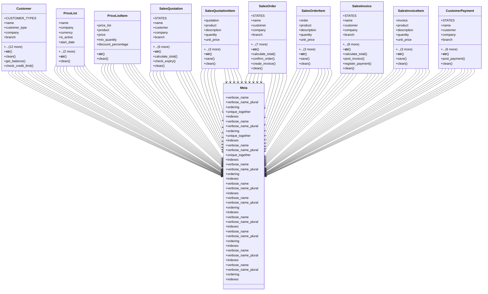

# business_modules.sales.models

## Imports
- business_modules.inventory.models
- core_modules.companies.models
- core_modules.permissions.models
- django.core.exceptions
- django.core.validators
- django.db
- django.utils
- django.utils.translation
- services_modules.accounting.models

## Classes
- Customer
  - attr: `CUSTOMER_TYPES`
  - attr: `name`
  - attr: `customer_type`
  - attr: `company`
  - attr: `branch`
  - attr: `address`
  - attr: `city`
  - attr: `country`
  - attr: `phone`
  - attr: `mobile`
  - attr: `email`
  - attr: `website`
  - attr: `tax_id`
  - attr: `credit_limit`
  - attr: `payment_term`
  - attr: `is_active`
  - attr: `notes`
  - method: `__str__`
  - method: `clean`
  - method: `get_balance`
  - method: `check_credit_limit`
- PriceList
  - attr: `name`
  - attr: `company`
  - attr: `currency`
  - attr: `is_active`
  - attr: `start_date`
  - attr: `end_date`
  - attr: `notes`
  - method: `__str__`
  - method: `clean`
- PriceListItem
  - attr: `price_list`
  - attr: `product`
  - attr: `price`
  - attr: `min_quantity`
  - attr: `discount_percentage`
  - method: `__str__`
  - method: `clean`
- SalesQuotation
  - attr: `STATES`
  - attr: `name`
  - attr: `customer`
  - attr: `company`
  - attr: `branch`
  - attr: `price_list`
  - attr: `quotation_date`
  - attr: `expiry_date`
  - attr: `state`
  - attr: `total_amount`
  - attr: `notes`
  - method: `__str__`
  - method: `calculate_total`
  - method: `check_expiry`
  - method: `clean`
- SalesQuotationItem
  - attr: `quotation`
  - attr: `product`
  - attr: `description`
  - attr: `quantity`
  - attr: `unit_price`
  - attr: `discount_percentage`
  - attr: `tax_rate`
  - attr: `subtotal`
  - method: `__str__`
  - method: `save`
  - method: `clean`
- SalesOrder
  - attr: `STATES`
  - attr: `name`
  - attr: `customer`
  - attr: `company`
  - attr: `branch`
  - attr: `quotation`
  - attr: `price_list`
  - attr: `order_date`
  - attr: `expected_delivery_date`
  - attr: `state`
  - attr: `total_amount`
  - attr: `notes`
  - method: `__str__`
  - method: `calculate_total`
  - method: `confirm_order`
  - method: `create_invoice`
  - method: `clean`
- SalesOrderItem
  - attr: `order`
  - attr: `product`
  - attr: `description`
  - attr: `quantity`
  - attr: `unit_price`
  - attr: `discount_percentage`
  - attr: `tax_rate`
  - attr: `subtotal`
  - method: `__str__`
  - method: `save`
  - method: `clean`
- SalesInvoice
  - attr: `STATES`
  - attr: `name`
  - attr: `customer`
  - attr: `company`
  - attr: `branch`
  - attr: `sales_order`
  - attr: `invoice_date`
  - attr: `due_date`
  - attr: `state`
  - attr: `total_amount`
  - attr: `amount_paid`
  - attr: `amount_due`
  - attr: `price_list`
  - attr: `notes`
  - method: `__str__`
  - method: `calculate_total`
  - method: `post_invoice`
  - method: `register_payment`
  - method: `clean`
- SalesInvoiceItem
  - attr: `invoice`
  - attr: `product`
  - attr: `description`
  - attr: `quantity`
  - attr: `unit_price`
  - attr: `discount_percentage`
  - attr: `tax_rate`
  - attr: `subtotal`
  - method: `__str__`
  - method: `save`
  - method: `clean`
- CustomerPayment
  - attr: `STATES`
  - attr: `name`
  - attr: `customer`
  - attr: `company`
  - attr: `branch`
  - attr: `invoice`
  - attr: `payment_date`
  - attr: `amount`
  - attr: `journal`
  - attr: `state`
  - attr: `notes`
  - method: `__str__`
  - method: `post_payment`
  - method: `clean`
- Meta
  - attr: `verbose_name`
  - attr: `verbose_name_plural`
  - attr: `ordering`
  - attr: `unique_together`
  - attr: `indexes`
- Meta
  - attr: `verbose_name`
  - attr: `verbose_name_plural`
  - attr: `ordering`
  - attr: `unique_together`
  - attr: `indexes`
- Meta
  - attr: `verbose_name`
  - attr: `verbose_name_plural`
  - attr: `unique_together`
  - attr: `indexes`
- Meta
  - attr: `verbose_name`
  - attr: `verbose_name_plural`
  - attr: `ordering`
  - attr: `indexes`
- Meta
  - attr: `verbose_name`
  - attr: `verbose_name_plural`
  - attr: `indexes`
- Meta
  - attr: `verbose_name`
  - attr: `verbose_name_plural`
  - attr: `ordering`
  - attr: `indexes`
- Meta
  - attr: `verbose_name`
  - attr: `verbose_name_plural`
  - attr: `indexes`
- Meta
  - attr: `verbose_name`
  - attr: `verbose_name_plural`
  - attr: `ordering`
  - attr: `indexes`
- Meta
  - attr: `verbose_name`
  - attr: `verbose_name_plural`
  - attr: `indexes`
- Meta
  - attr: `verbose_name`
  - attr: `verbose_name_plural`
  - attr: `ordering`
  - attr: `indexes`

## Functions
- __str__
- clean
- get_balance
- check_credit_limit
- __str__
- clean
- __str__
- clean
- __str__
- calculate_total
- check_expiry
- clean
- __str__
- save
- clean
- __str__
- calculate_total
- confirm_order
- create_invoice
- clean
- __str__
- save
- clean
- __str__
- calculate_total
- post_invoice
- register_payment
- clean
- __str__
- save
- clean
- __str__
- post_payment
- clean

## Class Diagram

