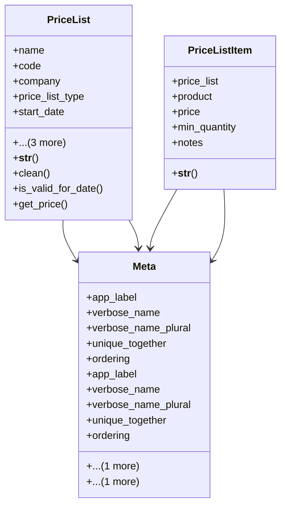

# business_modules.sales.models.price_list

## Imports
- business_modules.inventory.models
- core_modules.companies.models
- django.core.exceptions
- django.db
- django.utils
- django.utils.translation

## Classes
- PriceList
  - attr: `name`
  - attr: `code`
  - attr: `company`
  - attr: `price_list_type`
  - attr: `start_date`
  - attr: `end_date`
  - attr: `is_active`
  - attr: `description`
  - method: `__str__`
  - method: `clean`
  - method: `is_valid_for_date`
  - method: `get_price`
- PriceListItem
  - attr: `price_list`
  - attr: `product`
  - attr: `price`
  - attr: `min_quantity`
  - attr: `notes`
  - method: `__str__`
- Meta
  - attr: `app_label`
  - attr: `verbose_name`
  - attr: `verbose_name_plural`
  - attr: `unique_together`
  - attr: `ordering`
  - attr: `indexes`
- Meta
  - attr: `app_label`
  - attr: `verbose_name`
  - attr: `verbose_name_plural`
  - attr: `unique_together`
  - attr: `ordering`
  - attr: `indexes`

## Functions
- __str__
- clean
- is_valid_for_date
- get_price
- __str__

## Class Diagram

