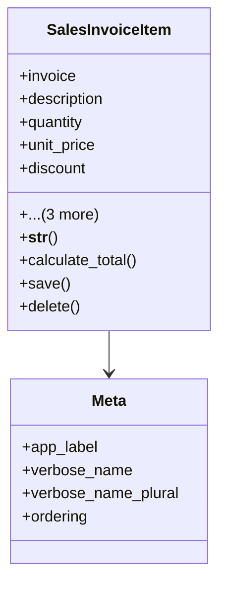

# business_modules.sales.models.sales_invoice_item

## Imports
- decimal
- django.db
- sales_invoice

## Classes
- SalesInvoiceItem
  - attr: `invoice`
  - attr: `description`
  - attr: `quantity`
  - attr: `unit_price`
  - attr: `discount`
  - attr: `tax_rate`
  - attr: `total_price`
  - attr: `product_reference`
  - method: `__str__`
  - method: `calculate_total`
  - method: `save`
  - method: `delete`
- Meta
  - attr: `app_label`
  - attr: `verbose_name`
  - attr: `verbose_name_plural`
  - attr: `ordering`

## Functions
- __str__
- calculate_total
- save
- delete

## Class Diagram

