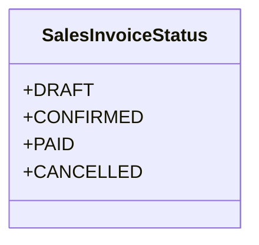

# business_modules.sales.models.sales_invoice_status

## Imports
- django.db
- django.utils.translation

## Classes
- SalesInvoiceStatus
  - attr: `DRAFT`
  - attr: `CONFIRMED`
  - attr: `PAID`
  - attr: `CANCELLED`

## Class Diagram

