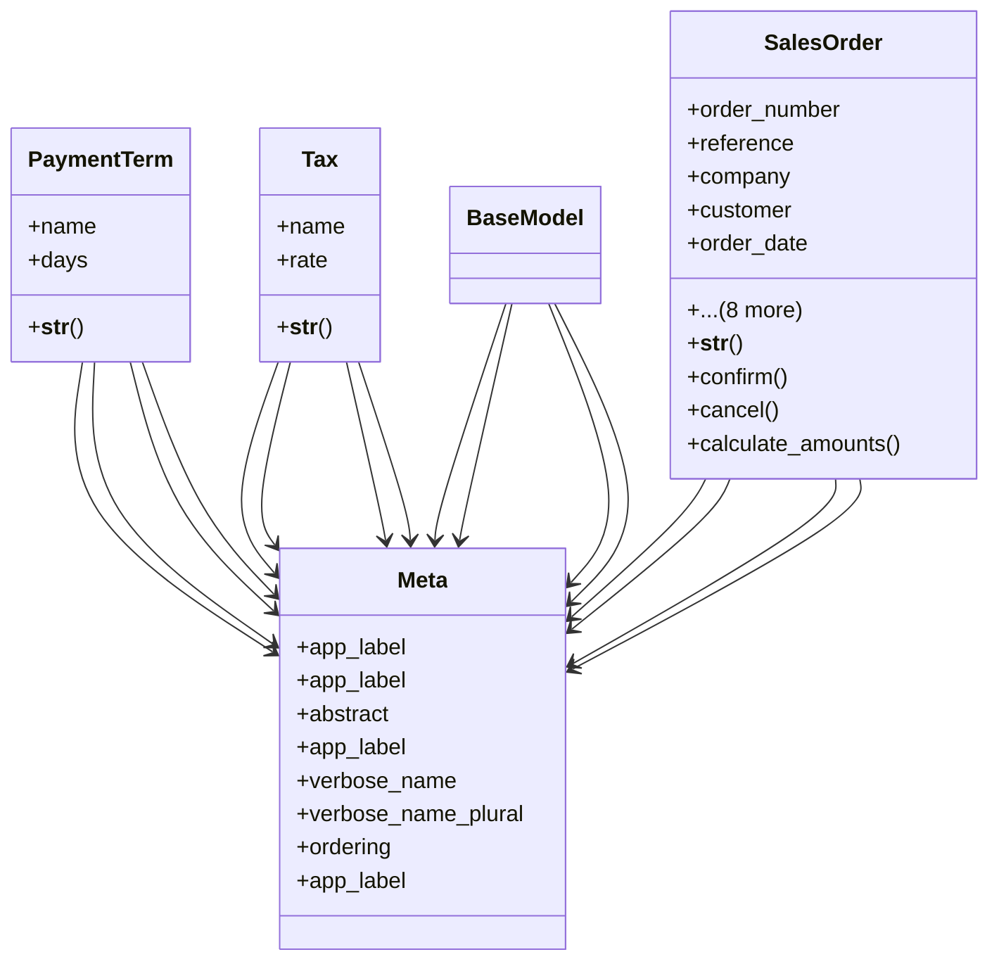

# business_modules.sales.models.sales_order

## Imports
- core_modules.companies.models
- core_modules.core.models.base_models
- customer
- django.db
- django.utils
- django.utils.translation

## Classes
- PaymentTerm
  - attr: `name`
  - attr: `days`
  - method: `__str__`
- Tax
  - attr: `name`
  - attr: `rate`
  - method: `__str__`
- BaseModel
- SalesOrder
  - attr: `order_number`
  - attr: `reference`
  - attr: `company`
  - attr: `customer`
  - attr: `order_date`
  - attr: `validity_date`
  - attr: `expected_delivery_date`
  - attr: `payment_term`
  - attr: `untaxed_amount`
  - attr: `tax_amount`
  - attr: `total_amount`
  - attr: `state`
  - attr: `notes`
  - method: `__str__`
  - method: `confirm`
  - method: `cancel`
  - method: `calculate_amounts`
- Meta
  - attr: `app_label`
- Meta
  - attr: `app_label`
- Meta
  - attr: `abstract`
  - attr: `app_label`
- Meta
  - attr: `verbose_name`
  - attr: `verbose_name_plural`
  - attr: `ordering`
  - attr: `app_label`

## Functions
- __str__
- __str__
- __str__
- confirm
- cancel
- calculate_amounts

## Class Diagram

