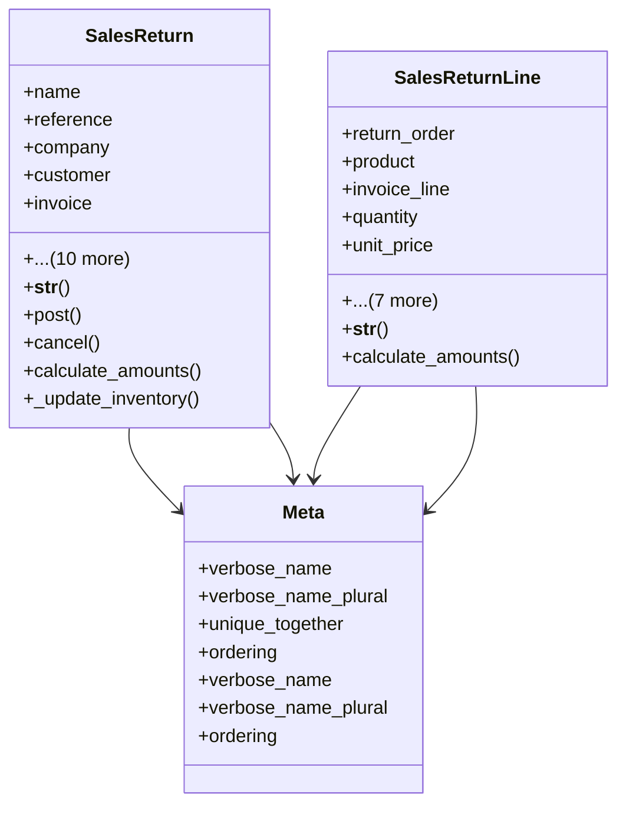

# business_modules.sales.models.sales_return

## Imports
- business_modules.inventory.models
- core_modules.companies.models
- customer
- decimal
- django.contrib.auth
- django.db
- django.utils
- django.utils.translation
- sales_invoice
- services_modules.accounting.models
- services_modules.accounting.services.journal_service
- services_modules.inventory.services.stock_service

## Classes
- SalesReturn
  - attr: `name`
  - attr: `reference`
  - attr: `company`
  - attr: `customer`
  - attr: `invoice`
  - attr: `date`
  - attr: `untaxed_amount`
  - attr: `tax_amount`
  - attr: `total_amount`
  - attr: `state`
  - attr: `return_reason`
  - attr: `created_by`
  - attr: `posted_by`
  - attr: `cancelled_by`
  - attr: `notes`
  - method: `__str__`
  - method: `post`
  - method: `cancel`
  - method: `calculate_amounts`
  - method: `_update_inventory`
- SalesReturnLine
  - attr: `return_order`
  - attr: `product`
  - attr: `invoice_line`
  - attr: `quantity`
  - attr: `unit_price`
  - attr: `discount_percent`
  - attr: `discount_amount`
  - attr: `tax_amount`
  - attr: `subtotal`
  - attr: `total`
  - attr: `description`
  - attr: `sequence`
  - method: `__str__`
  - method: `calculate_amounts`
- Meta
  - attr: `verbose_name`
  - attr: `verbose_name_plural`
  - attr: `unique_together`
  - attr: `ordering`
- Meta
  - attr: `verbose_name`
  - attr: `verbose_name_plural`
  - attr: `ordering`

## Functions
- __str__
- post
- cancel
- calculate_amounts
- _update_inventory
- __str__
- calculate_amounts

## Module Variables
- `User`

## Class Diagram

