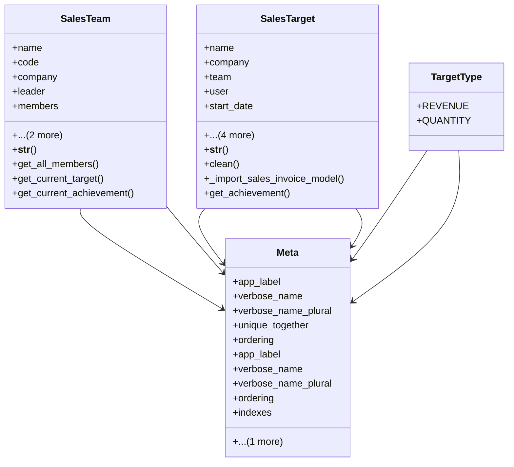

# business_modules.sales.models.sales_team

## Imports
- core_modules.companies.models
- decimal
- django.contrib.auth
- django.core.exceptions
- django.db
- django.db.models
- django.utils
- django.utils.translation

## Classes
- SalesTeam
  - attr: `name`
  - attr: `code`
  - attr: `company`
  - attr: `leader`
  - attr: `members`
  - attr: `is_active`
  - attr: `description`
  - method: `__str__`
  - method: `get_all_members`
  - method: `get_current_target`
  - method: `get_current_achievement`
- SalesTarget
  - attr: `name`
  - attr: `company`
  - attr: `team`
  - attr: `user`
  - attr: `start_date`
  - attr: `end_date`
  - attr: `target_type`
  - attr: `target_amount`
  - attr: `description`
  - method: `__str__`
  - method: `clean`
  - method: `_import_sales_invoice_model`
  - method: `get_achievement`
- Meta
  - attr: `app_label`
  - attr: `verbose_name`
  - attr: `verbose_name_plural`
  - attr: `unique_together`
  - attr: `ordering`
  - attr: `indexes`
- TargetType
  - attr: `REVENUE`
  - attr: `QUANTITY`
- Meta
  - attr: `app_label`
  - attr: `verbose_name`
  - attr: `verbose_name_plural`
  - attr: `ordering`
  - attr: `indexes`

## Functions
- __str__
- get_all_members
- get_current_target
- get_current_achievement
- __str__
- clean
- _import_sales_invoice_model
- get_achievement

## Module Variables
- `User`

## Class Diagram

