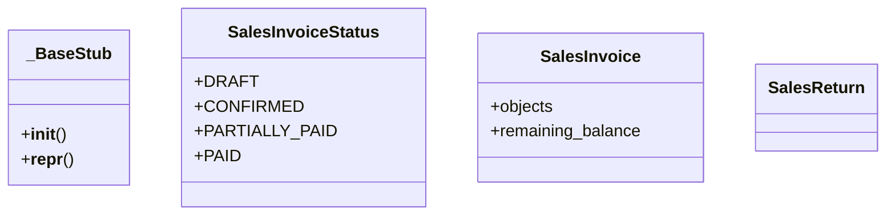

# business_modules.sales.models.stub_minimal

## Imports
- __future__

## Classes
- _BaseStub
  - method: `__init__`
  - method: `__repr__`
- SalesInvoiceStatus
  - attr: `DRAFT`
  - attr: `CONFIRMED`
  - attr: `PARTIALLY_PAID`
  - attr: `PAID`
- SalesInvoice
  - attr: `objects`
  - attr: `remaining_balance`
- SalesReturn

## Functions
- __init__
- __repr__

## Module Variables
- `__all__`

## Class Diagram

