# business_modules.sales.permissions

## Imports
- django.contrib.auth
- django.utils.translation
- rest_framework
- typing

## Classes
- IsSalesManager
  - attr: `message`
  - method: `has_permission`
- IsSalesEngineerUser
  - attr: `message`
  - method: `has_permission`
- CanViewSalesData
  - attr: `message`
  - method: `has_permission`
  - method: `has_object_permission`
- CanManageQuotations
  - attr: `message`
  - method: `has_permission`
  - method: `has_object_permission`
- CanModifySalesOrder
  - attr: `message`
  - method: `has_object_permission`
- CanApproveSalesOrder
  - attr: `message`
  - method: `has_permission`
  - method: `has_object_permission`
- CanManageDeliveryNotes
  - attr: `message`
  - method: `has_permission`
  - method: `has_object_permission`
- CanManageInvoices
  - attr: `message`
  - method: `has_permission`
  - method: `has_object_permission`
- CanPostInvoices
  - attr: `message`
  - method: `has_permission`
  - method: `has_object_permission`

## Functions
- _in_groups
- has_permission
- has_permission
- has_permission
- has_object_permission
- has_permission
- has_object_permission
- has_object_permission
- has_permission
- has_object_permission
- has_permission
- has_object_permission
- has_permission
- has_object_permission
- has_permission
- has_object_permission

## Module Variables
- `User`
- `SALES_MANAGER_GROUPS`
- `SALES_ENGINEER_GROUPS`

## Class Diagram

```mermaid
classDiagram
    class IsSalesManager {
        +message
        +has_permission()
    }
    class IsSalesEngineerUser {
        +message
        +has_permission()
    }
    class CanViewSalesData {
        +message
        +has_permission()
        +has_object_permission()
    }
    class CanManageQuotations {
        +message
        +has_permission()
        +has_object_permission()
    }
    class CanModifySalesOrder {
        +message
        +has_object_permission()
    }
    class CanApproveSalesOrder {
        +message
        +has_permission()
        +has_object_permission()
    }
    class CanManageDeliveryNotes {
        +message
        +has_permission()
        +has_object_permission()
    }
    class CanManageInvoices {
        +message
        +has_permission()
        +has_object_permission()
    }
    class CanPostInvoices {
        +message
        +has_permission()
        +has_object_permission()
    }
```

