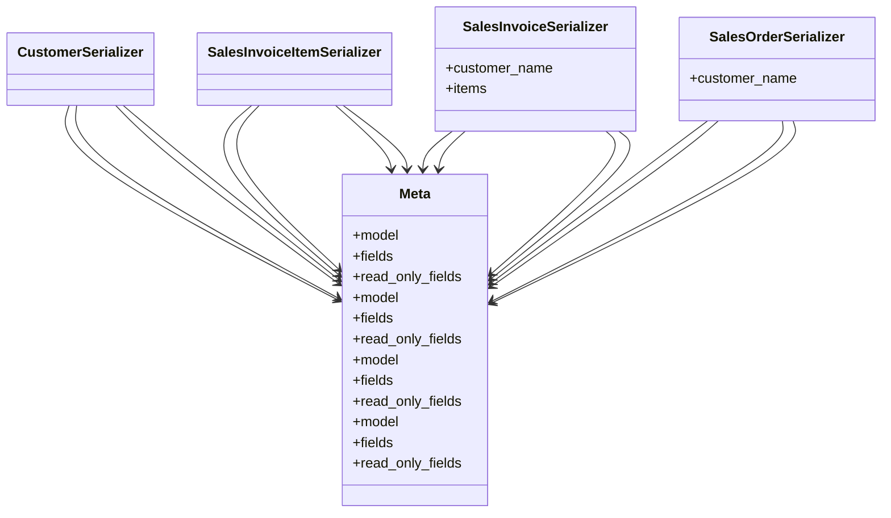

# business_modules.sales.serializers

## Imports
- models
- rest_framework

## Classes
- CustomerSerializer
- SalesInvoiceItemSerializer
- SalesInvoiceSerializer
  - attr: `customer_name`
  - attr: `items`
- SalesOrderSerializer
  - attr: `customer_name`
- Meta
  - attr: `model`
  - attr: `fields`
  - attr: `read_only_fields`
- Meta
  - attr: `model`
  - attr: `fields`
  - attr: `read_only_fields`
- Meta
  - attr: `model`
  - attr: `fields`
  - attr: `read_only_fields`
- Meta
  - attr: `model`
  - attr: `fields`
  - attr: `read_only_fields`

## Class Diagram

