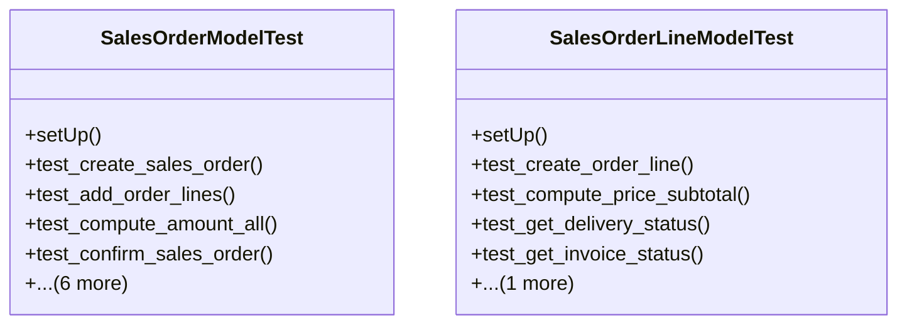

# business_modules.sales.tests.test_sales_order

## Imports
- datetime
- decimal
- django.core.exceptions
- django.db
- django.test
- django.utils
- models.customer
- models.sales_order
- services_modules.accounting.models
- services_modules.core.models
- services_modules.inventory.models

## Classes
- SalesOrderModelTest
  - method: `setUp`
  - method: `test_create_sales_order`
  - method: `test_add_order_lines`
  - method: `test_compute_amount_all`
  - method: `test_confirm_sales_order`
  - method: `test_cancel_sales_order`
  - method: `test_reset_to_draft`
  - method: `test_order_line_price_subtotal`
  - method: `test_get_delivery_status`
  - method: `test_get_invoice_status`
  - method: `test_update_prices_from_pricelist`
- SalesOrderLineModelTest
  - method: `setUp`
  - method: `test_create_order_line`
  - method: `test_compute_price_subtotal`
  - method: `test_get_delivery_status`
  - method: `test_get_invoice_status`
  - method: `test_get_amount_to_invoice`

## Functions
- setUp
- test_create_sales_order
- test_add_order_lines
- test_compute_amount_all
- test_confirm_sales_order
- test_cancel_sales_order
- test_reset_to_draft
- test_order_line_price_subtotal
- test_get_delivery_status
- test_get_invoice_status
- test_update_prices_from_pricelist
- setUp
- test_create_order_line
- test_compute_price_subtotal
- test_get_delivery_status
- test_get_invoice_status
- test_get_amount_to_invoice
- mock_update_prices

## Class Diagram

