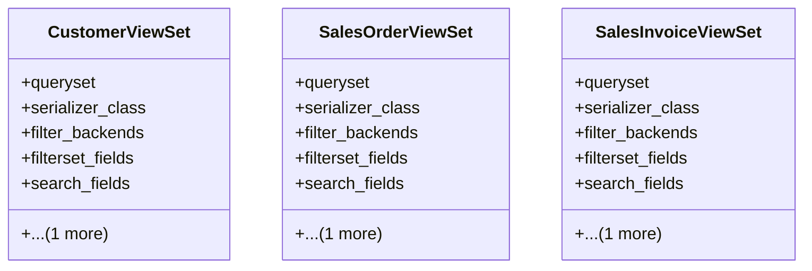

# business_modules.sales.views

## Imports
- django_filters.rest_framework
- models
- rest_framework
- rest_framework.decorators
- rest_framework.response
- serializers

## Classes
- CustomerViewSet
  - attr: `queryset`
  - attr: `serializer_class`
  - attr: `filter_backends`
  - attr: `filterset_fields`
  - attr: `search_fields`
  - attr: `ordering_fields`
- SalesOrderViewSet
  - attr: `queryset`
  - attr: `serializer_class`
  - attr: `filter_backends`
  - attr: `filterset_fields`
  - attr: `search_fields`
  - attr: `ordering_fields`
- SalesInvoiceViewSet
  - attr: `queryset`
  - attr: `serializer_class`
  - attr: `filter_backends`
  - attr: `filterset_fields`
  - attr: `search_fields`
  - attr: `ordering_fields`

## Functions
- list_view
- detail_view

## Class Diagram

