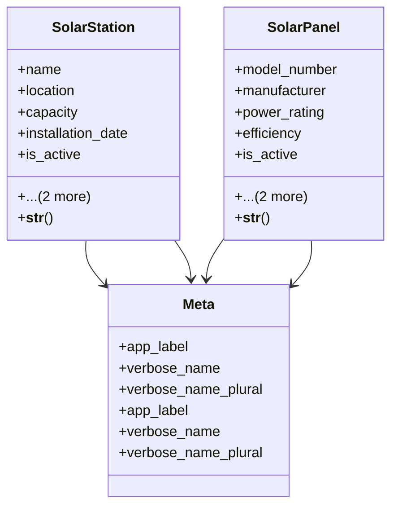

# business_modules.solar_stations.models

## Imports
- django.db
- django.utils.translation

## Classes
- SolarStation
  - attr: `name`
  - attr: `location`
  - attr: `capacity`
  - attr: `installation_date`
  - attr: `is_active`
  - attr: `created_at`
  - attr: `updated_at`
  - method: `__str__`
- SolarPanel
  - attr: `model_number`
  - attr: `manufacturer`
  - attr: `power_rating`
  - attr: `efficiency`
  - attr: `is_active`
  - attr: `created_at`
  - attr: `updated_at`
  - method: `__str__`
- Meta
  - attr: `app_label`
  - attr: `verbose_name`
  - attr: `verbose_name_plural`
- Meta
  - attr: `app_label`
  - attr: `verbose_name`
  - attr: `verbose_name_plural`

## Functions
- __str__
- __str__

## Class Diagram

