# business_modules.solar_stations.serializers

## Imports
- django.utils
- models
- rest_framework

## Classes
- SolarStationSerializer
  - attr: `company_name`
  - attr: `total_production_today`
  - attr: `total_production_month`
  - attr: `panels_count`
  - attr: `active_agreements_count`
  - method: `get_total_production_today`
  - method: `get_total_production_month`
  - method: `get_panels_count`
  - method: `get_active_agreements_count`
- SolarPanelSerializer
  - attr: `station_name`
- EnergyProductionSerializer
  - attr: `station_name`
  - attr: `efficiency_rating`
  - method: `get_efficiency_rating`
- EnergyProductionLogSerializer
  - attr: `station_name`
- SolarExpenseLogSerializer
  - attr: `station_name`
- SolarCustomerSerializer
  - attr: `agreements_count`
  - attr: `total_energy_purchased`
  - method: `get_agreements_count`
  - method: `get_total_energy_purchased`
- SolarSaleAgreementSerializer
  - attr: `station_name`
  - attr: `customer_name`
  - attr: `is_active`
  - attr: `days_remaining`
  - method: `get_is_active`
  - method: `get_days_remaining`
- MaintenanceRecordSerializer
  - attr: `station_name`
  - attr: `panel_id`
  - attr: `is_overdue`
  - method: `get_is_overdue`
- SolarStationDetailSerializer
  - attr: `panels`
  - attr: `recent_production`
  - attr: `active_agreements`
  - attr: `pending_maintenance`
- SolarCustomerDetailSerializer
  - attr: `agreements`
- Meta
  - attr: `model`
  - attr: `fields`
- Meta
  - attr: `model`
  - attr: `fields`
- Meta
  - attr: `model`
  - attr: `fields`
- Meta
  - attr: `model`
  - attr: `fields`
- Meta
  - attr: `model`
  - attr: `fields`
- Meta
  - attr: `model`
  - attr: `fields`
- Meta
  - attr: `model`
  - attr: `fields`
- Meta
  - attr: `model`
  - attr: `fields`
- Meta
- Meta

## Functions
- get_total_production_today
- get_total_production_month
- get_panels_count
- get_active_agreements_count
- get_efficiency_rating
- get_agreements_count
- get_total_energy_purchased
- get_is_active
- get_days_remaining
- get_is_overdue

## Class Diagram

```mermaid
classDiagram
    class SolarStationSerializer {
        +company_name
        +total_production_today
        +total_production_month
        +panels_count
        +active_agreements_count
        +get_total_production_today()
        +get_total_production_month()
        +get_panels_count()
        +get_active_agreements_count()
    }
    class SolarPanelSerializer {
        +station_name
    }
    class EnergyProductionSerializer {
        +station_name
        +efficiency_rating
        +get_efficiency_rating()
    }
    class EnergyProductionLogSerializer {
        +station_name
    }
    class SolarExpenseLogSerializer {
        +station_name
    }
    class SolarCustomerSerializer {
        +agreements_count
        +total_energy_purchased
        +get_agreements_count()
        +get_total_energy_purchased()
    }
    class SolarSaleAgreementSerializer {
        +station_name
        +customer_name
        +is_active
        +days_remaining
        +get_is_active()
        +get_days_remaining()
    }
    class MaintenanceRecordSerializer {
        +station_name
        +panel_id
        +is_overdue
        +get_is_overdue()
    }
    class SolarStationDetailSerializer {
        +panels
        +recent_production
        +active_agreements
        +pending_maintenance
    }
    class SolarCustomerDetailSerializer {
        +agreements
    }
    class Meta {
        +model
        +fields
    }
    class Meta {
        +model
        +fields
    }
    class Meta {
        +model
        +fields
    }
    class Meta {
        +model
        +fields
    }
    class Meta {
        +model
        +fields
    }
    class Meta {
        +model
        +fields
    }
    class Meta {
        +model
        +fields
    }
    class Meta {
        +model
        +fields
    }
    class Meta {
    }
    class Meta {
    }
    SolarStationSerializer --> Meta
    SolarStationSerializer --> Meta
    SolarStationSerializer --> Meta
    SolarStationSerializer --> Meta
    SolarStationSerializer --> Meta
    SolarStationSerializer --> Meta
    SolarStationSerializer --> Meta
    SolarStationSerializer --> Meta
    SolarStationSerializer --> Meta
    SolarStationSerializer --> Meta
    SolarPanelSerializer --> Meta
    SolarPanelSerializer --> Meta
    SolarPanelSerializer --> Meta
    SolarPanelSerializer --> Meta
    SolarPanelSerializer --> Meta
    SolarPanelSerializer --> Meta
    SolarPanelSerializer --> Meta
    SolarPanelSerializer --> Meta
    SolarPanelSerializer --> Meta
    SolarPanelSerializer --> Meta
    EnergyProductionSerializer --> Meta
    EnergyProductionSerializer --> Meta
    EnergyProductionSerializer --> Meta
    EnergyProductionSerializer --> Meta
    EnergyProductionSerializer --> Meta
    EnergyProductionSerializer --> Meta
    EnergyProductionSerializer --> Meta
    EnergyProductionSerializer --> Meta
    EnergyProductionSerializer --> Meta
    EnergyProductionSerializer --> Meta
    EnergyProductionLogSerializer --> Meta
    EnergyProductionLogSerializer --> Meta
    EnergyProductionLogSerializer --> Meta
    EnergyProductionLogSerializer --> Meta
    EnergyProductionLogSerializer --> Meta
    EnergyProductionLogSerializer --> Meta
    EnergyProductionLogSerializer --> Meta
    EnergyProductionLogSerializer --> Meta
    EnergyProductionLogSerializer --> Meta
    EnergyProductionLogSerializer --> Meta
    SolarExpenseLogSerializer --> Meta
    SolarExpenseLogSerializer --> Meta
    SolarExpenseLogSerializer --> Meta
    SolarExpenseLogSerializer --> Meta
    SolarExpenseLogSerializer --> Meta
    SolarExpenseLogSerializer --> Meta
    SolarExpenseLogSerializer --> Meta
    SolarExpenseLogSerializer --> Meta
    SolarExpenseLogSerializer --> Meta
    SolarExpenseLogSerializer --> Meta
    SolarCustomerSerializer --> Meta
    SolarCustomerSerializer --> Meta
    SolarCustomerSerializer --> Meta
    SolarCustomerSerializer --> Meta
    SolarCustomerSerializer --> Meta
    SolarCustomerSerializer --> Meta
    SolarCustomerSerializer --> Meta
    SolarCustomerSerializer --> Meta
    SolarCustomerSerializer --> Meta
    SolarCustomerSerializer --> Meta
    SolarSaleAgreementSerializer --> Meta
    SolarSaleAgreementSerializer --> Meta
    SolarSaleAgreementSerializer --> Meta
    SolarSaleAgreementSerializer --> Meta
    SolarSaleAgreementSerializer --> Meta
    SolarSaleAgreementSerializer --> Meta
    SolarSaleAgreementSerializer --> Meta
    SolarSaleAgreementSerializer --> Meta
    SolarSaleAgreementSerializer --> Meta
    SolarSaleAgreementSerializer --> Meta
    MaintenanceRecordSerializer --> Meta
    MaintenanceRecordSerializer --> Meta
    MaintenanceRecordSerializer --> Meta
    MaintenanceRecordSerializer --> Meta
    MaintenanceRecordSerializer --> Meta
    MaintenanceRecordSerializer --> Meta
    MaintenanceRecordSerializer --> Meta
    MaintenanceRecordSerializer --> Meta
    MaintenanceRecordSerializer --> Meta
    MaintenanceRecordSerializer --> Meta
    SolarStationDetailSerializer --> Meta
    SolarStationDetailSerializer --> Meta
    SolarStationDetailSerializer --> Meta
    SolarStationDetailSerializer --> Meta
    SolarStationDetailSerializer --> Meta
    SolarStationDetailSerializer --> Meta
    SolarStationDetailSerializer --> Meta
    SolarStationDetailSerializer --> Meta
    SolarStationDetailSerializer --> Meta
    SolarStationDetailSerializer --> Meta
    SolarCustomerDetailSerializer --> Meta
    SolarCustomerDetailSerializer --> Meta
    SolarCustomerDetailSerializer --> Meta
    SolarCustomerDetailSerializer --> Meta
    SolarCustomerDetailSerializer --> Meta
    SolarCustomerDetailSerializer --> Meta
    SolarCustomerDetailSerializer --> Meta
    SolarCustomerDetailSerializer --> Meta
    SolarCustomerDetailSerializer --> Meta
    SolarCustomerDetailSerializer --> Meta
```

