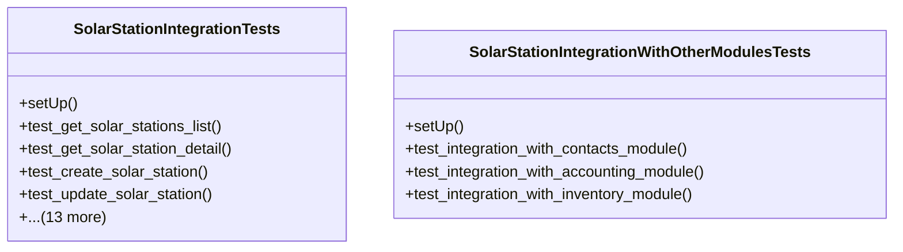

# business_modules.solar_stations.tests.test_integration

## Imports
- business_modules.contacts.models
- business_modules.solar_station.models
- datetime
- django.contrib.auth
- django.test
- django.urls
- json
- rest_framework
- rest_framework.test

## Classes
- SolarStationIntegrationTests
  - method: `setUp`
  - method: `test_get_solar_stations_list`
  - method: `test_get_solar_station_detail`
  - method: `test_create_solar_station`
  - method: `test_update_solar_station`
  - method: `test_get_production_logs`
  - method: `test_create_production_log`
  - method: `test_get_customers_list`
  - method: `test_get_customer_detail`
  - method: `test_get_pricing_tiers`
  - method: `test_get_sale_agreements`
  - method: `test_get_billing_invoices`
  - method: `test_mark_invoice_as_paid`
  - method: `test_get_expense_logs`
  - method: `test_get_maintenance_records`
  - method: `test_create_maintenance_record`
  - method: `test_get_production_stats`
  - method: `test_get_financial_report`
- SolarStationIntegrationWithOtherModulesTests
  - method: `setUp`
  - method: `test_integration_with_contacts_module`
  - method: `test_integration_with_accounting_module`
  - method: `test_integration_with_inventory_module`

## Functions
- setUp
- test_get_solar_stations_list
- test_get_solar_station_detail
- test_create_solar_station
- test_update_solar_station
- test_get_production_logs
- test_create_production_log
- test_get_customers_list
- test_get_customer_detail
- test_get_pricing_tiers
- test_get_sale_agreements
- test_get_billing_invoices
- test_mark_invoice_as_paid
- test_get_expense_logs
- test_get_maintenance_records
- test_create_maintenance_record
- test_get_production_stats
- test_get_financial_report
- setUp
- test_integration_with_contacts_module
- test_integration_with_accounting_module
- test_integration_with_inventory_module

## Module Variables
- `User`

## Class Diagram

