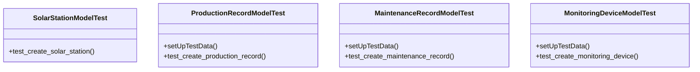

# business_modules.solar_stations.tests.test_models

## Imports
- business_modules.solar_stations.models
- django.contrib.auth.models
- django.db
- django.test
- django.utils

## Classes
- SolarStationModelTest
  - method: `test_create_solar_station`
- ProductionRecordModelTest
  - method: `setUpTestData`
  - method: `test_create_production_record`
- MaintenanceRecordModelTest
  - method: `setUpTestData`
  - method: `test_create_maintenance_record`
- MonitoringDeviceModelTest
  - method: `setUpTestData`
  - method: `test_create_monitoring_device`

## Functions
- test_create_solar_station
- setUpTestData
- test_create_production_record
- setUpTestData
- test_create_maintenance_record
- setUpTestData
- test_create_monitoring_device

## Class Diagram

