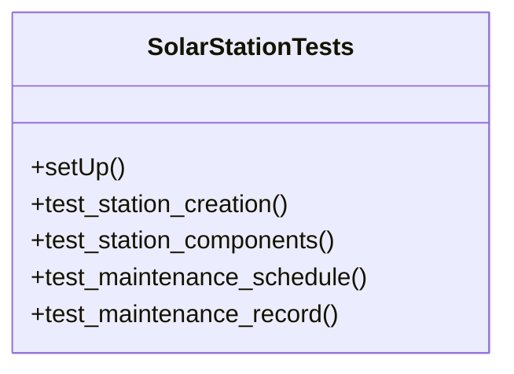

# business_modules.solar_stations.tests.test_solar_station

## Imports
- business_modules.solar_stations.models
- django.contrib.auth.models
- django.test
- django.utils

## Classes
- SolarStationTests
  - method: `setUp`
  - method: `test_station_creation`
  - method: `test_station_components`
  - method: `test_maintenance_schedule`
  - method: `test_maintenance_record`

## Functions
- setUp
- test_station_creation
- test_station_components
- test_maintenance_schedule
- test_maintenance_record

## Class Diagram

