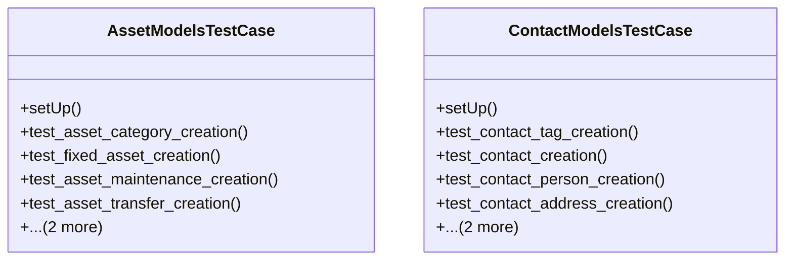

# business_modules.tests.test_models

## Imports
- assets.models
- contacts.models
- core_modules.organization.models
- decimal
- django.contrib.auth
- django.core.exceptions
- django.test
- django.utils

## Classes
- AssetModelsTestCase
  - method: `setUp`
  - method: `test_asset_category_creation`
  - method: `test_fixed_asset_creation`
  - method: `test_asset_maintenance_creation`
  - method: `test_asset_transfer_creation`
  - method: `test_asset_depreciation_creation`
  - method: `test_asset_validation`
- ContactModelsTestCase
  - method: `setUp`
  - method: `test_contact_tag_creation`
  - method: `test_contact_creation`
  - method: `test_contact_person_creation`
  - method: `test_contact_address_creation`
  - method: `test_contact_bank_account_creation`
  - method: `test_contact_validation`

## Functions
- setUp
- test_asset_category_creation
- test_fixed_asset_creation
- test_asset_maintenance_creation
- test_asset_transfer_creation
- test_asset_depreciation_creation
- test_asset_validation
- setUp
- test_contact_tag_creation
- test_contact_creation
- test_contact_person_creation
- test_contact_address_creation
- test_contact_bank_account_creation
- test_contact_validation

## Module Variables
- `User`

## Class Diagram

