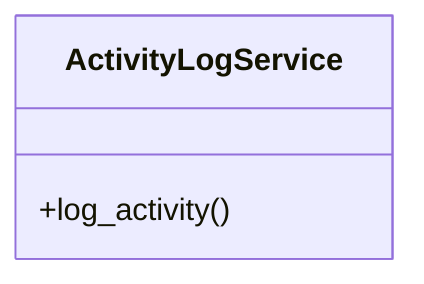

# core_modules.activity_log.services.__init__

## Imports
- audit_trail_service

## Classes
- ActivityLogService
  - method: `log_activity`

## Functions
- log_activity

## Module Variables
- `__all__`

## Class Diagram

