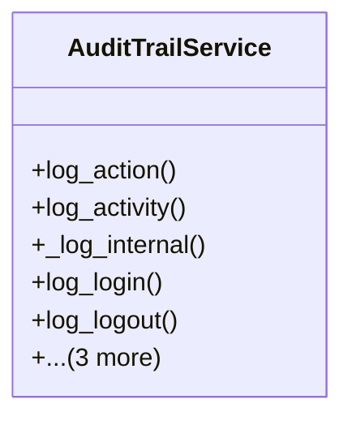

# core_modules.activity_log.services.audit_trail_service

## Imports
- django.contrib.auth
- django.contrib.contenttypes.models
- django.utils
- json
- typing

## Classes
- AuditTrailService
  - method: `log_action`
  - method: `log_activity`
  - method: `_log_internal`
  - method: `log_login`
  - method: `log_logout`
  - method: `log_permission_denied`
  - method: `log_data_export`
  - method: `log_data_import`

## Functions
- log_action
- log_activity
- _log_internal
- log_login
- log_logout
- log_permission_denied
- log_data_export
- log_data_import

## Module Variables
- `User`

## Class Diagram

