# core_modules.ai_permissions.admin

## Imports
- django.contrib
- django.utils.html
- django.utils.translation
- models

## Classes
- AIModelAdmin
  - attr: `list_display`
  - attr: `list_filter`
  - attr: `search_fields`
  - attr: `fieldsets`
- AIAgentAdmin
  - attr: `list_display`
  - attr: `list_filter`
  - attr: `search_fields`
  - attr: `readonly_fields`
  - attr: `fieldsets`
  - method: `ai_model_display`
  - method: `owner_display`
- AgentRoleAdmin
  - attr: `list_display`
  - attr: `list_filter`
  - attr: `search_fields`
  - attr: `readonly_fields`
  - attr: `fieldsets`
  - method: `scope_display`
- AIRoleAdmin
  - attr: `list_display`
  - attr: `list_filter`
  - attr: `search_fields`
  - attr: `readonly_fields`
  - attr: `fieldsets`
- AIModelPermissionAdmin
  - attr: `list_display`
  - attr: `list_filter`
  - attr: `search_fields`
  - attr: `readonly_fields`
  - attr: `fieldsets`
  - method: `permissions_display`
- AIPermissionDependencyAdmin
  - attr: `list_display`
  - attr: `list_filter`
  - attr: `search_fields`
  - attr: `readonly_fields`
  - attr: `fieldsets`
- A2APermissionAdmin
  - attr: `list_display`
  - attr: `list_filter`
  - attr: `search_fields`
  - attr: `readonly_fields`
  - attr: `fieldsets`
  - method: `permissions_display`
- AIPermissionAuditLogAdmin
  - attr: `list_display`
  - attr: `list_filter`
  - attr: `search_fields`
  - attr: `readonly_fields`
  - attr: `fieldsets`
  - method: `has_add_permission`
  - method: `has_change_permission`

## Functions
- ai_model_display
- owner_display
- scope_display
- permissions_display
- permissions_display
- has_add_permission
- has_change_permission

## Class Diagram

```mermaid
classDiagram
    class AIModelAdmin {
        +list_display
        +list_filter
        +search_fields
        +fieldsets
    }
    class AIAgentAdmin {
        +list_display
        +list_filter
        +search_fields
        +readonly_fields
        +fieldsets
        +ai_model_display()
        +owner_display()
    }
    class AgentRoleAdmin {
        +list_display
        +list_filter
        +search_fields
        +readonly_fields
        +fieldsets
        +scope_display()
    }
    class AIRoleAdmin {
        +list_display
        +list_filter
        +search_fields
        +readonly_fields
        +fieldsets
    }
    class AIModelPermissionAdmin {
        +list_display
        +list_filter
        +search_fields
        +readonly_fields
        +fieldsets
        +permissions_display()
    }
    class AIPermissionDependencyAdmin {
        +list_display
        +list_filter
        +search_fields
        +readonly_fields
        +fieldsets
    }
    class A2APermissionAdmin {
        +list_display
        +list_filter
        +search_fields
        +readonly_fields
        +fieldsets
        +permissions_display()
    }
    class AIPermissionAuditLogAdmin {
        +list_display
        +list_filter
        +search_fields
        +readonly_fields
        +fieldsets
        +has_add_permission()
        +has_change_permission()
    }
```

