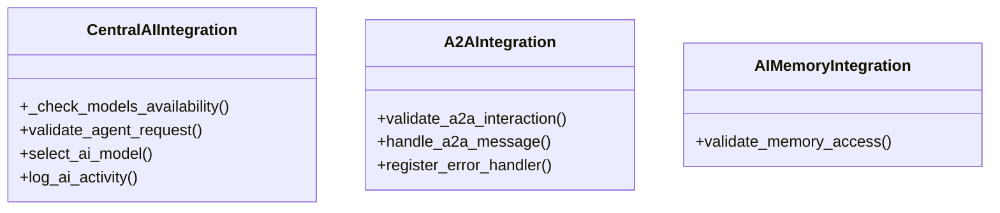

# core_modules.ai_permissions.integrations

## Imports
- config
- django.core.exceptions
- django.utils
- json
- logging
- models
- services
- typing

## Classes
- CentralAIIntegration
  - method: `_check_models_availability`
  - method: `validate_agent_request`
  - method: `select_ai_model`
  - method: `log_ai_activity`
- A2AIntegration
  - method: `validate_a2a_interaction`
  - method: `handle_a2a_message`
  - method: `register_error_handler`
- AIMemoryIntegration
  - method: `validate_memory_access`

## Functions
- _check_models_availability
- validate_agent_request
- select_ai_model
- log_ai_activity
- validate_a2a_interaction
- handle_a2a_message
- register_error_handler
- validate_memory_access

## Module Variables
- `logger`

## Class Diagram

