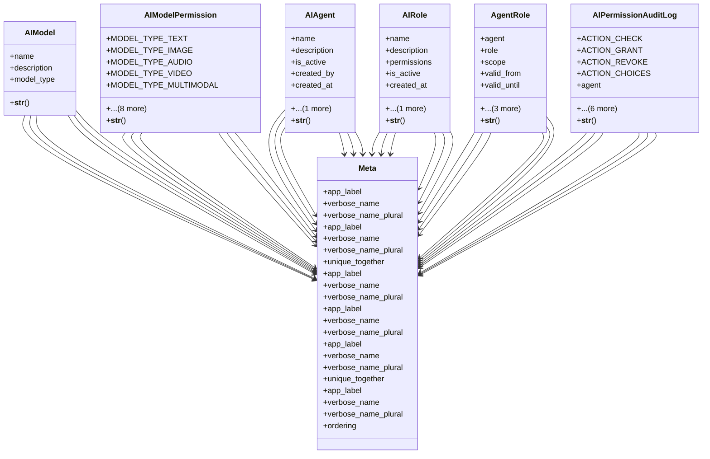

# core_modules.ai_permissions.models

## Imports
- django.conf
- django.db
- django.utils.translation

## Classes
- AIModel
  - attr: `name`
  - attr: `description`
  - attr: `model_type`
  - method: `__str__`
- AIModelPermission
  - attr: `MODEL_TYPE_TEXT`
  - attr: `MODEL_TYPE_IMAGE`
  - attr: `MODEL_TYPE_AUDIO`
  - attr: `MODEL_TYPE_VIDEO`
  - attr: `MODEL_TYPE_MULTIMODAL`
  - attr: `MODEL_TYPE_EMBEDDING`
  - attr: `MODEL_TYPE_CHOICES`
  - attr: `name`
  - attr: `model_type`
  - attr: `description`
  - attr: `is_active`
  - attr: `created_at`
  - attr: `updated_at`
  - method: `__str__`
- AIAgent
  - attr: `name`
  - attr: `description`
  - attr: `is_active`
  - attr: `created_by`
  - attr: `created_at`
  - attr: `updated_at`
  - method: `__str__`
- AIRole
  - attr: `name`
  - attr: `description`
  - attr: `permissions`
  - attr: `is_active`
  - attr: `created_at`
  - attr: `updated_at`
  - method: `__str__`
- AgentRole
  - attr: `agent`
  - attr: `role`
  - attr: `scope`
  - attr: `valid_from`
  - attr: `valid_until`
  - attr: `is_active`
  - attr: `assigned_by`
  - attr: `created_at`
  - method: `__str__`
- AIPermissionAuditLog
  - attr: `ACTION_CHECK`
  - attr: `ACTION_GRANT`
  - attr: `ACTION_REVOKE`
  - attr: `ACTION_CHOICES`
  - attr: `agent`
  - attr: `action`
  - attr: `permission`
  - attr: `result`
  - attr: `details`
  - attr: `user`
  - attr: `timestamp`
  - method: `__str__`
- Meta
  - attr: `app_label`
  - attr: `verbose_name`
  - attr: `verbose_name_plural`
- Meta
  - attr: `app_label`
  - attr: `verbose_name`
  - attr: `verbose_name_plural`
  - attr: `unique_together`
- Meta
  - attr: `app_label`
  - attr: `verbose_name`
  - attr: `verbose_name_plural`
- Meta
  - attr: `app_label`
  - attr: `verbose_name`
  - attr: `verbose_name_plural`
- Meta
  - attr: `app_label`
  - attr: `verbose_name`
  - attr: `verbose_name_plural`
  - attr: `unique_together`
- Meta
  - attr: `app_label`
  - attr: `verbose_name`
  - attr: `verbose_name_plural`
  - attr: `ordering`

## Functions
- __str__
- __str__
- __str__
- __str__
- __str__
- __str__

## Module Variables
- `NAME_LABEL`
- `DESCRIPTION_LABEL`
- `MODEL_TYPE_TEXT`
- `MODEL_TYPE_IMAGE`
- `MODEL_TYPE_AUDIO`
- `MODEL_TYPES`

## Class Diagram

